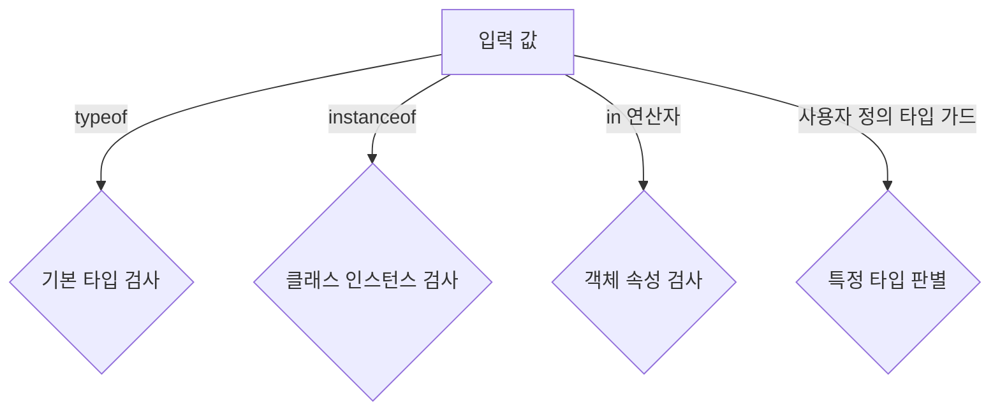

# 🛡 TypeScript 타입 가드 (Type Guards)

## 📌 개요
타입 가드(Type Guards)는 **유니온 타입** 또는 **알 수 없는 타입**을 보다 구체적인 타입으로 좁히는 기법입니다. TypeScript에서는 **`typeof` 연산자, `instanceof` 연산자, 사용자 정의 타입 가드**를 활용하여 안전한 코드 작성을 도울 수 있습니다. 🚀

---

## 🏗 `typeof` 연산자를 활용한 타입 가드
`typeof` 연산자는 **기본 타입**(string, number, boolean 등)을 판별하는 데 유용합니다.

### ✅ `typeof`를 사용한 타입 검증
```typescript
function formatValue(value: string | number) {
    if (typeof value === "string") {
        return value.toUpperCase();
    } else {
        return value.toFixed(2);
    }
}

console.log(formatValue("hello")); // "HELLO"
console.log(formatValue(42)); // "42.00"
```
- `typeof value === "string"` → `value`가 `string` 타입일 경우 대문자로 변환
- `typeof value === "number"` → `value`가 `number` 타입일 경우 소수점 두 자리로 변환

---

## 🏗 `instanceof` 연산자를 활용한 타입 가드
클래스 인스턴스를 판별할 때 `instanceof` 연산자를 사용할 수 있습니다.

### ✅ `instanceof`를 사용한 타입 검증
```typescript
class Dog {
    bark() {
        console.log("Woof! Woof!");
    }
}

class Cat {
    meow() {
        console.log("Meow! Meow!");
    }
}

function makeSound(animal: Dog | Cat) {
    if (animal instanceof Dog) {
        animal.bark();
    } else {
        animal.meow();
    }
}

const dog = new Dog();
const cat = new Cat();

makeSound(dog); // "Woof! Woof!"
makeSound(cat); // "Meow! Meow!"
```
- `instanceof`를 사용하여 `Dog` 또는 `Cat` 클래스의 인스턴스를 구별
- `animal instanceof Dog` → `Dog` 클래스의 인스턴스일 경우 `bark()` 호출

---

## 🏗 사용자 정의 타입 가드
타입 가드를 직접 정의할 수도 있습니다. 이를 통해 객체의 속성을 확인하고 특정 타입으로 좁힐 수 있습니다.

### ✅ `is` 키워드를 사용한 사용자 정의 타입 가드
```typescript
interface Car {
    brand: string;
    wheels: number;
}

interface Bike {
    brand: string;
    hasPedals: boolean;
}

type Vehicle = Car | Bike;

function isCar(vehicle: Vehicle): vehicle is Car {
    return (vehicle as Car).wheels !== undefined;
}

function printVehicleInfo(vehicle: Vehicle) {
    if (isCar(vehicle)) {
        console.log(`Car Brand: ${vehicle.brand}, Wheels: ${vehicle.wheels}`);
    } else {
        console.log(`Bike Brand: ${vehicle.brand}, Has Pedals: ${vehicle.hasPedals}`);
    }
}

const myCar: Car = { brand: "Toyota", wheels: 4 };
const myBike: Bike = { brand: "Giant", hasPedals: true };

printVehicleInfo(myCar); // "Car Brand: Toyota, Wheels: 4"
printVehicleInfo(myBike); // "Bike Brand: Giant, Has Pedals: true"
```
- `isCar(vehicle: Vehicle): vehicle is Car` → `vehicle`이 `Car` 타입인지 검사하는 함수
- `return (vehicle as Car).wheels !== undefined;` → `wheels` 속성이 존재하는지 확인

---

## 🏗 `in` 연산자를 활용한 타입 가드
객체 내부에 특정 속성이 존재하는지 확인할 때 `in` 연산자를 사용할 수 있습니다.

### ✅ `in` 연산자를 사용한 속성 검사
```typescript
interface Bird {
    fly: () => void;
}

interface Fish {
    swim: () => void;
}

type Animal = Bird | Fish;

function move(animal: Animal) {
    if ("fly" in animal) {
        animal.fly();
    } else {
        animal.swim();
    }
}

const bird: Bird = { fly: () => console.log("Flying...") };
const fish: Fish = { swim: () => console.log("Swimming...") };

move(bird); // "Flying..."
move(fish); // "Swimming..."
```
- `"fly" in animal` → `animal` 객체에 `fly` 속성이 존재하면 `Bird` 타입으로 간주

---

## 🔎 타입 가드 다이어그램


---

## 🎯 정리 및 다음 단계
✅ **`typeof`를 사용하면 기본 타입을 검사할 수 있습니다.**
✅ **`instanceof`는 클래스 인스턴스를 판별하는 데 유용합니다.**
✅ **사용자 정의 타입 가드를 활용하여 더 정교한 타입 검사를 할 수 있습니다.**
✅ **`in` 연산자를 활용하여 객체 내부 속성을 안전하게 확인할 수 있습니다.**

👉 **다음 강의: [03-mapped-and-utility-types.md](./03-mapped-and-utility-types.md)**

