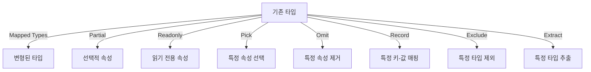

# 🎯 TypeScript 매핑된 타입 & 유틸리티 타입 (Mapped & Utility Types)

## 📌 개요
TypeScript에서는 **매핑된 타입(Mapped Types)** 을 사용하여 기존 타입을 변형할 수 있으며, **유틸리티 타입(Utility Types)** 을 활용하면 반복적인 타입 정의 없이 효율적인 타입 변형이 가능합니다. 이 장에서는 **Partial, Readonly, Record, Pick, Omit, Exclude, Extract** 등의 유틸리티 타입과 매핑된 타입을 학습합니다. 🚀

---

## 🔄 매핑된 타입 (Mapped Types)
기존 타입을 기반으로 변형된 새로운 타입을 만들 수 있습니다.

### ✅ 기본 매핑된 타입
```typescript
type Optional<T> = {
    [P in keyof T]?: T[P];
};

interface User {
    name: string;
    age: number;
}

type PartialUser = Optional<User>;

const user: PartialUser = { name: "Alice" }; // age는 선택적 속성이 됨
```
- `keyof T` → `T` 타입의 모든 속성 이름을 가져옴
- `[P in keyof T]` → 각 속성을 순회하며 변형
- `?:` → 모든 속성을 선택적으로 변환

### ✅ `readonly` 속성 추가하기
```typescript
type Immutable<T> = {
    readonly [P in keyof T]: T[P];
};

type ReadonlyUser = Immutable<User>;
const user: ReadonlyUser = { name: "Bob", age: 30 };
// user.age = 31; // ❌ 오류 발생 (읽기 전용 속성)
```
- `readonly` 키워드를 추가하여 모든 속성을 읽기 전용으로 변환

---

## ⚡ 유틸리티 타입 (Utility Types)
TypeScript는 자주 사용하는 타입 변환을 위한 유틸리티 타입을 기본적으로 제공합니다.

### ✅ `Partial<T>`: 모든 속성을 선택적으로 변환
```typescript
type PartialUser = Partial<User>;
const user: PartialUser = { name: "Alice" }; // age는 생략 가능
```

### ✅ `Readonly<T>`: 모든 속성을 읽기 전용으로 변환
```typescript
type ReadonlyUser = Readonly<User>;
const user: ReadonlyUser = { name: "Alice", age: 30 };
// user.age = 31; // ❌ 오류 발생 (읽기 전용 속성)
```

### ✅ `Record<K, T>`: 특정 키와 값을 매핑하여 타입 생성
```typescript
type UserRoles = "admin" | "user" | "guest";
const roles: Record<UserRoles, number> = {
    admin: 1,
    user: 2,
    guest: 3
};
```
- `Record<K, T>` → `K`는 키(Key), `T`는 값(Value) 타입을 지정

### ✅ `Pick<T, K>`: 특정 속성만 선택
```typescript
type PickedUser = Pick<User, "name">;
const user: PickedUser = { name: "Alice" };
```
- `Pick<T, K>` → `T`에서 `K`에 해당하는 속성만 선택

### ✅ `Omit<T, K>`: 특정 속성을 제외
```typescript
type OmittedUser = Omit<User, "age">;
const user: OmittedUser = { name: "Alice" };
```
- `Omit<T, K>` → `T`에서 `K`에 해당하는 속성을 제거

### ✅ `Exclude<T, U>`: 특정 타입 제외
```typescript
type ExcludedType = Exclude<"a" | "b" | "c", "a">; // "b" | "c"
```
- `Exclude<T, U>` → `T`에서 `U`에 해당하는 타입을 제외

### ✅ `Extract<T, U>`: 특정 타입 추출
```typescript
type ExtractedType = Extract<"a" | "b" | "c", "a" | "c">; // "a" | "c"
```
- `Extract<T, U>` → `T`에서 `U`에 해당하는 타입만 유지

---

## 🔎 매핑된 타입 & 유틸리티 타입 다이어그램


---

## 🎯 정리 및 다음 단계
✅ **매핑된 타입을 사용하여 기존 타입을 변형할 수 있습니다.**
✅ **`Partial`, `Readonly`, `Record`, `Pick`, `Omit` 등의 유틸리티 타입을 활용하면 더 효과적으로 타입을 관리할 수 있습니다.**
✅ **`Exclude` 및 `Extract`를 사용하여 특정 타입을 제외하거나 추출할 수 있습니다.**

👉 **다음 강의: [04-conditional-types.md](./04-conditional-types.md)**

