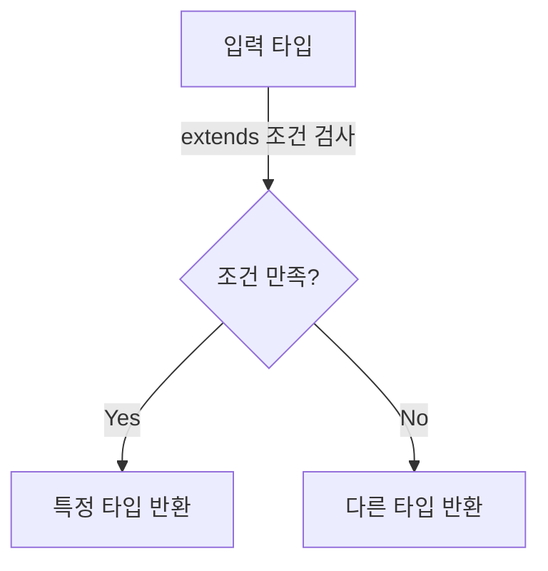

# 🔄 TypeScript 조건부 타입 (Conditional Types)

## 📌 개요
조건부 타입(Conditional Types)은 **타입을 동적으로 평가**하여 특정 조건을 만족하면 다른 타입을 반환하는 기능을 제공합니다. 이를 통해 **유연한 타입 설계**가 가능하며, `extends` 키워드를 활용하여 **제네릭 타입을 더욱 강력하게 제어**할 수 있습니다. 🚀

---

## 🔎 기본 조건부 타입 문법
조건부 타입의 기본 문법은 다음과 같습니다:
```typescript
type Conditional<T> = T extends number ? "숫자" : "문자";
```
- `T extends number ? "숫자" : "문자";` → `T`가 `number`이면 "숫자", 그렇지 않으면 "문자" 반환

### ✅ 기본 예제
```typescript
type CheckType<T> = T extends string ? "This is a string" : "Not a string";

type Result1 = CheckType<string>;  // "This is a string"
type Result2 = CheckType<number>;  // "Not a string"
```
- `CheckType<string>` → "This is a string"
- `CheckType<number>` → "Not a string"

---

## 🏗 조건부 타입과 제네릭
제네릭과 함께 사용하면 **더욱 동적인 타입 변환**이 가능합니다.

### ✅ 조건부 타입과 제네릭
```typescript
type ElementType<T> = T extends (infer U)[] ? U : T;

type Type1 = ElementType<string[]>;  // string

type Type2 = ElementType<number[]>;  // number

type Type3 = ElementType<boolean>;   // boolean
```
- `infer U`를 사용하여 배열의 요소 타입을 추출할 수 있음

### ✅ `infer`를 활용한 함수 반환 타입 추출
```typescript
type ReturnType<T> = T extends (...args: any[]) => infer R ? R : never;

function getName(): string {
    return "Alice";
}

type NameType = ReturnType<typeof getName>; // string
```
- `infer R` → 함수의 반환 타입을 추론하여 `R`에 저장

---

## 🔄 조건부 타입 활용 예제

### ✅ 유니온 타입에서 특정 타입 제외 (`Exclude`)
```typescript
type ExcludeType<T, U> = T extends U ? never : T;

type Example = ExcludeType<"a" | "b" | "c", "a">; // "b" | "c"
```
- `T extends U` → `T`가 `U`에 포함되면 `never`, 아니면 `T` 유지

### ✅ 유니온 타입에서 특정 타입만 추출 (`Extract`)
```typescript
type ExtractType<T, U> = T extends U ? T : never;

type Example = ExtractType<"a" | "b" | "c", "a" | "b">; // "a" | "b"
```
- `T extends U` → `T`가 `U`에 포함되면 `T` 유지, 아니면 `never`

### ✅ `NonNullable<T>`: `null`과 `undefined` 제거
```typescript
type NonNullableType<T> = T extends null | undefined ? never : T;

type Example = NonNullableType<string | null | undefined>; // string
```
- `T extends null | undefined ? never : T;` → `null` 또는 `undefined`가 아닌 경우만 유지

### ✅ `Awaited<T>`: `Promise`의 반환 타입 추출
```typescript
type Awaited<T> = T extends Promise<infer U> ? U : T;

async function fetchData() {
    return "Hello, TypeScript!";
}

type DataType = Awaited<ReturnType<typeof fetchData>>; // string
```
- `Promise<infer U>`를 활용하여 `Promise` 내부의 타입을 추출

---

## 📌 조건부 타입 다이어그램


---

## 🎯 정리 및 다음 단계
✅ **조건부 타입을 사용하면 동적인 타입 변환이 가능합니다.**
✅ **제네릭과 결합하면 더욱 강력한 타입 추론이 가능합니다.**
✅ **`infer` 키워드를 활용하여 함수 반환 타입 및 배열 요소 타입을 추출할 수 있습니다.**
✅ **`Exclude`, `Extract`, `NonNullable`, `Awaited` 등의 유틸리티 타입을 활용하여 유연한 타입 변형이 가능합니다.**

👉 **다음 강의: [05-decorators.md](./05-decorators.md)**

