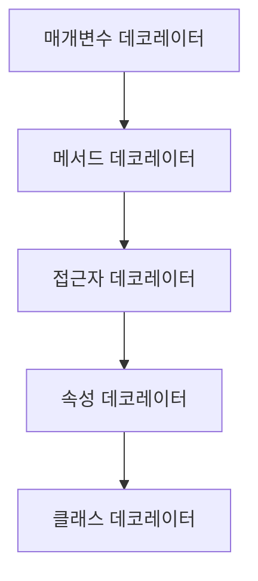

# 🎭 TypeScript 데코레이터 (Decorators)

## 📌 개요
데코레이터(Decorators)는 **클래스, 메서드, 속성, 접근자 등에 추가 기능을 적용하는 기능**입니다.
TypeScript에서 데코레이터는 **실험적 기능**으로, `tsconfig.json`에서 `experimentalDecorators` 옵션을 활성화해야 합니다. 🚀

---

## ⚙️ 데코레이터 설정하기
### ✅ 데코레이터 활성화 (`tsconfig.json` 수정)
```json
{
    "compilerOptions": {
        "experimentalDecorators": true,
        "emitDecoratorMetadata": true
    }
}
```
- `experimentalDecorators: true` → 데코레이터 기능 활성화
- `emitDecoratorMetadata: true` → 메타데이터 저장(선택 사항)

---

## 🔄 데코레이터 유형
TypeScript의 데코레이터는 **함수** 형태이며, 다음과 같은 유형이 있습니다.

| 유형 | 설명 |
|------|------|
| 클래스 데코레이터 | 클래스 선언에 적용 |
| 메서드 데코레이터 | 클래스의 메서드에 적용 |
| 속성 데코레이터 | 클래스의 속성에 적용 |
| 접근자 데코레이터 | `getter`, `setter`에 적용 |
| 매개변수 데코레이터 | 메서드의 매개변수에 적용 |

---

## 🏗 클래스 데코레이터
클래스 자체를 수정하거나 메타데이터를 추가하는 데 사용됩니다.

### ✅ 클래스 데코레이터 예제
```typescript
function Logger(constructor: Function) {
    console.log(`클래스 생성됨: ${constructor.name}`);
}

@Logger
class Person {
    constructor(public name: string) {}
}

const p = new Person("Alice");
// 출력: "클래스 생성됨: Person"
```
- `@Logger` → 클래스에 데코레이터 적용
- `constructor.name`을 출력하여 클래스 정보를 기록

---

## 🏗 메서드 데코레이터
메서드의 실행을 감싸거나 추가 로직을 삽입할 수 있습니다.

### ✅ 메서드 실행 시간 측정
```typescript
function MeasureTime(target: any, propertyKey: string, descriptor: PropertyDescriptor) {
    const originalMethod = descriptor.value;
    descriptor.value = function (...args: any[]) {
        console.time(propertyKey);
        const result = originalMethod.apply(this, args);
        console.timeEnd(propertyKey);
        return result;
    };
}

class MathOperations {
    @MeasureTime
    calculateSum(a: number, b: number): number {
        return a + b;
    }
}

const math = new MathOperations();
math.calculateSum(10, 20);
```
- `MeasureTime` → 메서드 실행 시간을 측정하는 데코레이터
- `console.time()`과 `console.timeEnd()`를 사용하여 실행 시간 출력

---

## 🏗 속성 데코레이터
클래스의 속성에 대해 동작을 변경할 때 사용됩니다.

### ✅ 속성 값 유효성 검사
```typescript
function ReadOnly(target: any, propertyKey: string) {
    Object.defineProperty(target, propertyKey, {
        writable: false
    });
}

class User {
    @ReadOnly
    username: string = "default_user";
}

const user = new User();
// user.username = "new_user"; // ❌ 오류 발생 (읽기 전용 속성)
```
- `Object.defineProperty()`를 사용하여 속성을 읽기 전용으로 설정

---

## 🏗 접근자 데코레이터
Getter 또는 Setter의 동작을 변경하는 데 사용됩니다.

### ✅ 접근자 호출 시 로그 기록
```typescript
function LogAccessor(target: any, propertyKey: string, descriptor: PropertyDescriptor) {
    const originalGetter = descriptor.get;
    descriptor.get = function () {
        console.log(`Getting value of ${propertyKey}`);
        return originalGetter?.apply(this);
    };
}

class Account {
    private _balance: number = 1000;

    @LogAccessor
    get balance(): number {
        return this._balance;
    }
}

const acc = new Account();
console.log(acc.balance); // "Getting value of balance"
```
- `descriptor.get`을 오버라이딩하여 Getter 실행 시 로그 기록

---

## 🏗 매개변수 데코레이터
메서드의 매개변수에 대한 메타데이터를 추가하는 데 사용됩니다.

### ✅ 메서드 인자 검증
```typescript
function Validate(target: any, propertyKey: string, parameterIndex: number) {
    console.log(`Validating parameter index ${parameterIndex} in method ${propertyKey}`);
}

class Service {
    process(@Validate data: string) {
        console.log(`Processing: ${data}`);
    }
}

const service = new Service();
service.process("Hello");
// 출력: "Validating parameter index 0 in method process"
```
- `parameterIndex`를 활용하여 특정 매개변수에 대한 정보를 로깅

---

## 📌 데코레이터 실행 순서
여러 개의 데코레이터가 하나의 요소에 적용될 경우 다음과 같은 순서로 실행됩니다:

1️⃣ **매개변수 데코레이터** → 2️⃣ **메서드 데코레이터** → 3️⃣ **접근자 데코레이터** → 4️⃣ **속성 데코레이터** → 5️⃣ **클래스 데코레이터**



---

## 🎯 정리 및 다음 단계
✅ **데코레이터는 클래스, 메서드, 속성 등에 추가 기능을 적용하는 강력한 기능입니다.**
✅ **`@Logger`, `@MeasureTime`, `@ReadOnly` 등의 데코레이터를 활용하여 코드의 가독성을 높일 수 있습니다.**
✅ **데코레이터는 여러 개를 조합할 수 있으며, 실행 순서를 이해하면 더욱 강력하게 활용할 수 있습니다.**

👉 **다음 강의: [06-asynchronous-programming.md](./06-asynchronous-programming.md)**

