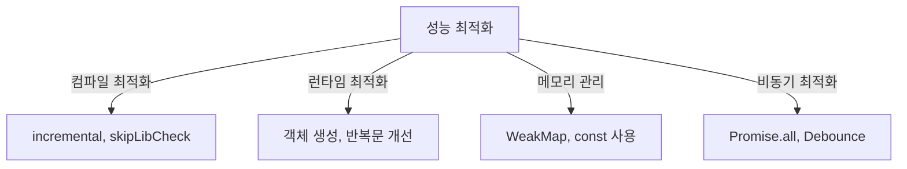

# 🚀 TypeScript 성능 최적화 (Performance Optimization)

## 📌 개요
TypeScript는 정적 타입 시스템을 제공하여 코드의 안정성을 높이지만, 성능을 고려한 최적화도 중요합니다. 이 장에서는 **컴파일 성능 최적화, 런타임 최적화, 메모리 관리 기법** 등을 학습합니다. 🚀

---

## ⚡ 컴파일 성능 최적화

### ✅ `incremental`을 사용한 증분 컴파일
TypeScript는 매번 전체 코드를 다시 컴파일합니다. `incremental` 옵션을 사용하면 **변경된 파일만 다시 컴파일**하여 속도를 향상시킬 수 있습니다.
```json
{
    "compilerOptions": {
        "incremental": true,
        "tsBuildInfoFile": "./tsconfig.tsbuildinfo"
    }
}
```
- `incremental: true` → 변경된 파일만 컴파일
- `tsBuildInfoFile` → 증분 빌드 정보를 저장하는 파일

### ✅ `skipLibCheck`로 외부 라이브러리 검사 건너뛰기
```json
{
    "compilerOptions": {
        "skipLibCheck": true
    }
}
```
- `skipLibCheck: true` → 외부 라이브러리의 타입 검사를 건너뛰어 컴파일 속도 향상

### ✅ `isolatedModules`를 사용하여 개별 파일 단위로 컴파일
```json
{
    "compilerOptions": {
        "isolatedModules": true
    }
}
```
- `isolatedModules: true` → 개별 파일 단위로 컴파일하여 속도 향상

---

## 🏗 런타임 성능 최적화

### ✅ 객체 생성 시 초기값 설정
객체를 생성할 때 기본값을 설정하면 불필요한 속성 추가를 줄여 성능을 향상시킬 수 있습니다.
```typescript
class User {
    name: string;
    age: number = 18; // 기본값 설정
    constructor(name: string) {
        this.name = name;
    }
}
const user = new User("Alice"); // age가 자동으로 18로 설정됨
```

### ✅ 불필요한 객체 생성 피하기
```typescript
function processUser(user?: { name: string }) {
    user = user ?? { name: "Guest" }; // 객체 재사용
    console.log(user.name);
}
```
- `??`(널 병합 연산자)를 활용하여 **새로운 객체 생성을 줄이고 기존 객체를 재사용**

### ✅ 반복문 최적화
```typescript
const arr = [1, 2, 3, 4, 5];
for (let i = 0, len = arr.length; i < len; i++) {
    console.log(arr[i]);
}
```
- 배열 길이를 `len`에 캐싱하여 **매 반복마다 `arr.length`를 다시 계산하지 않도록 최적화**

---

## 🛠 메모리 관리 최적화

### ✅ `const` 사용으로 불필요한 메모리 할당 방지
```typescript
const names = ["Alice", "Bob", "Charlie"];
names.push("David"); // 가능하지만, 재할당은 불가
```
- `const`를 사용하여 **불필요한 변수 재할당을 방지**하고 메모리 사용을 최적화

### ✅ `WeakMap`과 `WeakSet`을 활용한 가비지 컬렉션 최적화
```typescript
const cache = new WeakMap<object, string>();

function getData(obj: object) {
    if (!cache.has(obj)) {
        cache.set(obj, "Fetched Data");
    }
    return cache.get(obj);
}

const userObj = {};
console.log(getData(userObj)); // "Fetched Data"
```
- `WeakMap`을 사용하면 **객체가 더 이상 사용되지 않을 때 자동으로 가비지 컬렉션 처리됨**

---

## 🔄 비동기 성능 최적화

### ✅ `Promise.all`을 사용하여 병렬 처리
```typescript
async function fetchAll() {
    const [data1, data2] = await Promise.all([
        fetch("https://api.example.com/data1"),
        fetch("https://api.example.com/data2")
    ]);
    return [await data1.json(), await data2.json()];
}
```
- `Promise.all()`을 사용하여 여러 API 요청을 동시에 실행하여 성능 개선

### ✅ `Debounce`와 `Throttle`을 사용하여 이벤트 호출 최적화
```typescript
function debounce<T extends (...args: any[]) => void>(func: T, delay: number) {
    let timer: NodeJS.Timeout;
    return (...args: Parameters<T>) => {
        clearTimeout(timer);
        timer = setTimeout(() => func(...args), delay);
    };
}

const logMessage = debounce(() => console.log("Typing..."), 300);
document.addEventListener("keyup", logMessage);
```
- `debounce()`를 사용하여 **연속된 이벤트 호출을 일정 시간 동안 지연**

---

## 🔎 성능 최적화 다이어그램


---

## 🎯 정리 및 다음 단계
✅ **컴파일 속도를 높이기 위해 `incremental`, `skipLibCheck` 등의 옵션을 활용할 수 있습니다.**
✅ **객체 생성 및 불필요한 연산을 줄여 런타임 성능을 개선할 수 있습니다.**
✅ **`WeakMap`과 `WeakSet`을 활용하여 메모리 누수를 방지할 수 있습니다.**
✅ **비동기 코드에서 `Promise.all` 및 `Debounce`를 활용하면 더욱 효율적으로 실행할 수 있습니다.**

👉 **다음 강의: [08-testing-strategies.md](./08-testing-strategies.md)**

