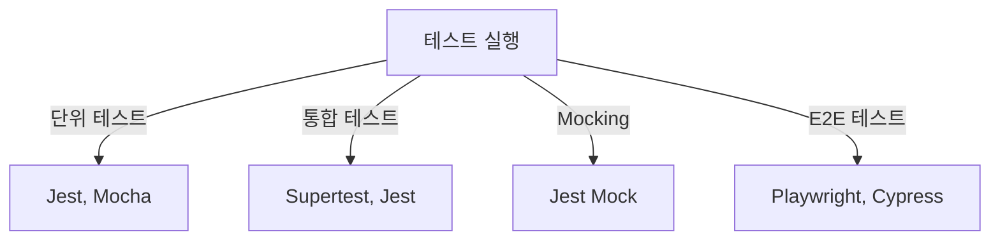

# 🧪 TypeScript 테스트 전략 (Testing Strategies)

## 📌 개요
TypeScript에서 테스트를 수행하는 것은 **코드의 신뢰성을 보장**하고, 버그를 줄이며 유지보수를 쉽게 만듭니다. 이 장에서는 **단위 테스트(Unit Testing), 통합 테스트(Integration Testing), 모킹(Mock), E2E 테스트** 등의 기법을 다룹니다. 🚀

---

## 🔎 TypeScript 테스트 프레임워크 선택
TypeScript에서 사용할 수 있는 주요 테스트 프레임워크:

| 프레임워크 | 특징 |
|------------|------|
| Jest | 빠르고 직관적인 API, 내장된 모킹 지원 |
| Mocha | 유연한 설정, 다양한 리포터 지원 |
| Jasmine | BDD 스타일 테스트 작성, Node.js 및 브라우저 지원 |
| AVA | 병렬 테스트 실행 최적화 |

✅ **추천**: **Jest**는 사용이 간편하고, TypeScript와 잘 통합되므로 가장 많이 사용됩니다.

---

## 🏗 Jest로 단위 테스트 작성
### ✅ Jest 설치
```bash
npm install --save-dev jest ts-jest @types/jest
```

### ✅ Jest 설정 (`jest.config.js`)
```javascript
module.exports = {
    preset: 'ts-jest',
    testEnvironment: 'node',
};
```

### ✅ 기본 테스트 예제 (`sum.ts` & `sum.test.ts`)
```typescript
// sum.ts
export function sum(a: number, b: number): number {
    return a + b;
}
```

```typescript
// sum.test.ts
import { sum } from "./sum";

test("adds 1 + 2 to equal 3", () => {
    expect(sum(1, 2)).toBe(3);
});
```

### ✅ 테스트 실행
```bash
npx jest
```
✅ **출력 예시**
```
PASS  ./sum.test.ts
✓ adds 1 + 2 to equal 3 (5ms)
```

---

## 🔄 통합 테스트 (Integration Testing)
통합 테스트는 **여러 모듈이 함께 동작하는지 검증**하는 테스트입니다.

### ✅ Express API 테스트 예제
```typescript
// app.ts
import express from "express";
export const app = express();
app.get("/hello", (req, res) => {
    res.json({ message: "Hello, TypeScript!" });
});
```

```typescript
// app.test.ts
import request from "supertest";
import { app } from "./app";

test("GET /hello should return JSON message", async () => {
    const response = await request(app).get("/hello");
    expect(response.status).toBe(200);
    expect(response.body).toEqual({ message: "Hello, TypeScript!" });
});
```

✅ **실행**
```bash
npx jest
```
✅ **출력 예시**
```
PASS  ./app.test.ts
✓ GET /hello should return JSON message (15ms)
```

---

## 🏗 Mocking을 활용한 테스트
Mocking(모킹)은 **외부 의존성을 제거하고, 테스트를 독립적으로 실행**할 수 있도록 합니다.

### ✅ Jest 모킹 예제
```typescript
// userService.ts
export class UserService {
    fetchUser(): string {
        return "Real User";
    }
}
```

```typescript
// userService.test.ts
import { UserService } from "./userService";

jest.mock("./userService", () => {
    return {
        UserService: jest.fn().mockImplementation(() => {
            return { fetchUser: () => "Mocked User" };
        })
    };
});

test("fetchUser should return mocked value", () => {
    const userService = new UserService();
    expect(userService.fetchUser()).toBe("Mocked User");
});
```

✅ **실행**
```bash
npx jest
```

✅ **출력 예시**
```
PASS  ./userService.test.ts
✓ fetchUser should return mocked value (8ms)
```

---

## 🏗 E2E 테스트 (End-to-End Testing)
E2E 테스트는 **전체 애플리케이션이 실제 사용자 환경에서 올바르게 동작하는지 확인**하는 테스트입니다.

### ✅ Playwright를 사용한 E2E 테스트
```bash
npm install --save-dev playwright
```

```typescript
// e2e.test.ts
import { chromium } from "playwright";

test("Check homepage title", async () => {
    const browser = await chromium.launch();
    const page = await browser.newPage();
    await page.goto("https://example.com");
    const title = await page.title();
    expect(title).toBe("Example Domain");
    await browser.close();
});
```

✅ **실행**
```bash
npx playwright test
```

✅ **출력 예시**
```
PASS  ./e2e.test.ts
✓ Check homepage title (2.5s)
```

---

## 🔎 테스트 전략 다이어그램


---

## 🎯 정리 및 다음 단계
✅ **단위 테스트를 작성하여 개별 함수와 모듈을 검증할 수 있습니다.**
✅ **통합 테스트를 활용하여 여러 모듈이 함께 작동하는지 확인할 수 있습니다.**
✅ **Mocking을 활용하면 외부 의존성을 제거하고 테스트를 더 독립적으로 실행할 수 있습니다.**
✅ **E2E 테스트를 통해 실제 사용자 환경에서 애플리케이션이 정상적으로 동작하는지 검증할 수 있습니다.**

👉 **다음 강의: [09-design-patterns.md](./09-design-patterns.md)**

