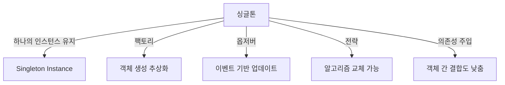

# 🎨 TypeScript 디자인 패턴 (Design Patterns)

## 📌 개요
디자인 패턴은 **반복적으로 발생하는 문제를 해결하는 소프트웨어 설계 기법**입니다. TypeScript에서는 **싱글톤(Singleton), 팩토리(Factory), 옵저버(Observer), 전략(Strategy), 의존성 주입(Dependency Injection)** 등의 패턴을 활용하여 유지보수성과 확장성을 향상할 수 있습니다. 🚀

---

## 🏗 싱글톤 패턴 (Singleton Pattern)
싱글톤 패턴은 **클래스의 인스턴스를 하나만 유지하도록 보장**하는 패턴입니다.

### ✅ 싱글톤 패턴 예제
```typescript
class Singleton {
    private static instance: Singleton;
    private constructor() {}

    static getInstance(): Singleton {
        if (!Singleton.instance) {
            Singleton.instance = new Singleton();
        }
        return Singleton.instance;
    }
}

const instance1 = Singleton.getInstance();
const instance2 = Singleton.getInstance();
console.log(instance1 === instance2); // true
```
- `getInstance()`를 통해 하나의 인스턴스만 유지

---

## 🏗 팩토리 패턴 (Factory Pattern)
팩토리 패턴은 **객체 생성을 위한 인터페이스를 제공하여 구체적인 클래스를 숨기는 기법**입니다.

### ✅ 팩토리 패턴 예제
```typescript
interface Car {
    drive(): void;
}

class Sedan implements Car {
    drive() {
        console.log("Driving a sedan...");
    }
}

class SUV implements Car {
    drive() {
        console.log("Driving an SUV...");
    }
}

class CarFactory {
    static createCar(type: "sedan" | "suv"): Car {
        if (type === "sedan") return new Sedan();
        if (type === "suv") return new SUV();
        throw new Error("Invalid car type");
    }
}

const myCar = CarFactory.createCar("suv");
myCar.drive(); // "Driving an SUV..."
```
- `CarFactory.createCar()`를 사용하여 객체 생성 방식 추상화

---

## 🏗 옵저버 패턴 (Observer Pattern)
옵저버 패턴은 **객체 간의 1:N 관계를 정의하여 한 객체의 상태 변화가 다른 객체들에게 자동으로 전달되도록 하는 패턴**입니다.

### ✅ 옵저버 패턴 예제
```typescript
interface Observer {
    update(message: string): void;
}

class ConcreteObserver implements Observer {
    constructor(private name: string) {}
    update(message: string) {
        console.log(`${this.name} received: ${message}`);
    }
}

class Subject {
    private observers: Observer[] = [];

    addObserver(observer: Observer) {
        this.observers.push(observer);
    }

    notify(message: string) {
        this.observers.forEach(observer => observer.update(message));
    }
}

const subject = new Subject();
const observer1 = new ConcreteObserver("Observer 1");
const observer2 = new ConcreteObserver("Observer 2");

subject.addObserver(observer1);
subject.addObserver(observer2);
subject.notify("New update available!");
// "Observer 1 received: New update available!"
// "Observer 2 received: New update available!"
```
- `Subject`는 `Observer` 리스트를 유지하고 변경 사항을 알림
- `ConcreteObserver`는 `update()` 메서드를 통해 변경 사항을 수신

---

## 🏗 전략 패턴 (Strategy Pattern)
전략 패턴은 **여러 알고리즘을 캡슐화하고 실행 시점에 교체할 수 있도록 하는 패턴**입니다.

### ✅ 전략 패턴 예제
```typescript
interface PaymentStrategy {
    pay(amount: number): void;
}

class CreditCardPayment implements PaymentStrategy {
    pay(amount: number) {
        console.log(`Paid ${amount} using Credit Card`);
    }
}

class PayPalPayment implements PaymentStrategy {
    pay(amount: number) {
        console.log(`Paid ${amount} using PayPal`);
    }
}

class PaymentProcessor {
    constructor(private strategy: PaymentStrategy) {}
    processPayment(amount: number) {
        this.strategy.pay(amount);
    }
}

const payment = new PaymentProcessor(new PayPalPayment());
payment.processPayment(100); // "Paid 100 using PayPal"
```
- `PaymentStrategy`를 구현하여 서로 다른 결제 방식을 쉽게 교체 가능

---

## 🏗 의존성 주입 (Dependency Injection, DI)
의존성 주입은 **클래스가 직접 의존성을 생성하는 것이 아니라 외부에서 주입받도록 하는 패턴**입니다.

### ✅ 의존성 주입 예제
```typescript
class Logger {
    log(message: string) {
        console.log(`Log: ${message}`);
    }
}

class UserService {
    constructor(private logger: Logger) {}

    createUser(name: string) {
        this.logger.log(`User ${name} created.`);
    }
}

const logger = new Logger();
const userService = new UserService(logger);
userService.createUser("Alice");
// "Log: User Alice created."
```
- `UserService`가 `Logger`의 인스턴스를 직접 생성하지 않고 외부에서 주입받음

---

## 🔎 디자인 패턴 다이어그램


---

## 🎯 정리 및 다음 단계
✅ **싱글톤 패턴을 사용하면 애플리케이션 전역에서 하나의 인스턴스를 유지할 수 있습니다.**
✅ **팩토리 패턴을 활용하여 객체 생성을 중앙 집중화할 수 있습니다.**
✅ **옵저버 패턴을 사용하면 이벤트 기반 시스템을 효율적으로 구축할 수 있습니다.**
✅ **전략 패턴을 통해 실행 시점에서 동적으로 알고리즘을 교체할 수 있습니다.**
✅ **의존성 주입을 통해 모듈 간 결합도를 낮추고 유지보수를 쉽게 만들 수 있습니다.**

