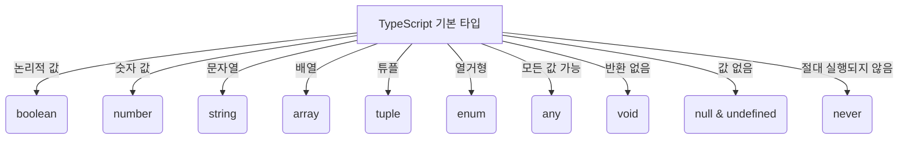

# 🎯 TypeScript 기본 타입 (Basic Types)

## 📌 개요
TypeScript는 JavaScript의 기본 데이터 타입을 확장하여 **더 강력한 타입 시스템**을 제공합니다. 여기서는 가장 많이 사용하는 기본 타입을 학습하고, 어떻게 활용할 수 있는지 알아보겠습니다. 🚀

---

## 🔍 TypeScript의 기본 타입
TypeScript에서 제공하는 주요 기본 타입은 다음과 같습니다:

| 타입 | 설명 | 예제 |
|------|------|------|
| `boolean` | 참/거짓을 나타내는 타입 | `let isDone: boolean = true;` |
| `number` | 모든 숫자 (정수 및 실수) | `let age: number = 25;` |
| `string` | 문자열 | `let name: string = "Alice";` |
| `array` | 요소가 같은 타입인 배열 | `let numbers: number[] = [1, 2, 3];` |
| `tuple` | 요소의 타입과 길이가 정해진 배열 | `let user: [string, number] = ["Alice", 25];` |
| `enum` | 열거형, 특정 값들의 집합 | `enum Color {Red, Green, Blue};` |
| `any` | 어떤 타입이든 허용 | `let value: any = "hello";` |
| `void` | 함수에서 반환 값이 없음을 의미 | `function logMessage(): void { console.log("Hello"); }` |
| `null & undefined` | 값이 비어 있음을 나타냄 | `let x: null = null;` |
| `never` | 절대 반환되지 않는 값 | `function error(message: string): never { throw new Error(message); }` |

---

## 📌 주요 타입 예제

### ✅ `boolean` (불리언 타입)
```typescript
let isCompleted: boolean = true;
console.log(isCompleted); // 출력: true
```

### ✅ `number` (숫자 타입)
```typescript
let decimal: number = 10;
let hex: number = 0xf00d;
let binary: number = 0b1010;
let octal: number = 0o744;
console.log(decimal, hex, binary, octal);
```

### ✅ `string` (문자열 타입)
```typescript
let userName: string = "Alice";
let greeting: string = `Hello, ${userName}!`;
console.log(greeting);
```

### ✅ `array` (배열 타입)
```typescript
let numbers: number[] = [1, 2, 3, 4, 5];
let fruits: Array<string> = ["apple", "banana", "orange"];
console.log(numbers, fruits);
```

### ✅ `tuple` (튜플 타입)
```typescript
let person: [string, number] = ["Alice", 25];
console.log(person);
```

### ✅ `enum` (열거형 타입)
```typescript
enum Direction {
    Up = 1,
    Down,
    Left,
    Right
}
let move: Direction = Direction.Up;
console.log(move); // 출력: 1
```

### ✅ `any` (모든 타입 허용)
```typescript
let randomValue: any = "Hello";
randomValue = 42;
randomValue = true;
console.log(randomValue);
```

### ✅ `void` (반환 값 없음)
```typescript
function sayHello(): void {
    console.log("Hello, world!");
}
sayHello();
```

### ✅ `null` 및 `undefined`
```typescript
let u: undefined = undefined;
let n: null = null;
console.log(u, n);
```

### ✅ `never` (절대 발생하지 않는 타입)
```typescript
function throwError(message: string): never {
    throw new Error(message);
}
```

---

## 🔎 기본 타입 다이어그램



---

## 🎯 정리 및 다음 단계
✅ TypeScript의 기본 타입을 학습했습니다!
✅ 타입을 활용하여 코드의 안정성을 높일 수 있습니다.
✅ 이제 인터페이스와 객체 타입을 살펴보겠습니다. 🚀

👉 **다음 강의: [03-functions.md](./03-functions.md)**

