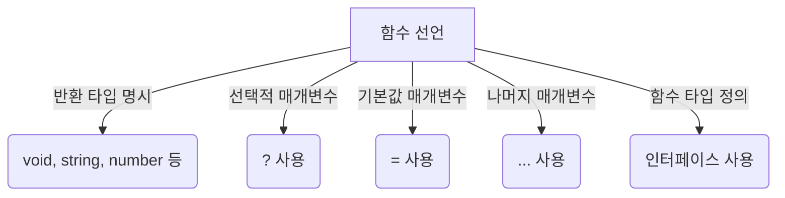

# 🎯 TypeScript 함수 (Functions)

## 📌 개요
함수는 프로그래밍에서 가장 중요한 요소 중 하나입니다. TypeScript에서는 함수에 **타입을 명시**하여 코드의 안전성을 높일 수 있습니다. 여기서는 **함수 선언, 매개변수, 반환 타입, 선택적 매개변수, 기본 매개변수, 나머지 매개변수, 함수 타입 정의** 등을 다룹니다. 🚀

---

## 🛠 함수 선언 및 반환 타입
TypeScript에서 함수는 **매개변수와 반환값에 타입을 명시**할 수 있습니다.

### ✅ 기본 함수 선언
```typescript
function greet(name: string): string {
    return `Hello, ${name}!`;
}

let message: string = greet("Alice");
console.log(message); // 출력: "Hello, Alice!"
```
- `name: string` → 매개변수 `name`은 문자열 타입을 가짐
- `: string` → 반환값의 타입을 문자열로 지정

### ✅ 반환값이 없는 함수 (`void` 타입)
```typescript
function logMessage(message: string): void {
    console.log(`Log: ${message}`);
}
logMessage("This is a log message");
```
- `void` 타입은 **반환값이 없음을 의미**

### ✅ 화살표 함수 (`Arrow Functions`)
```typescript
const add = (a: number, b: number): number => a + b;
console.log(add(5, 3)); // 출력: 8
```

---

## 📌 선택적 매개변수 & 기본 매개변수

### ✅ 선택적 매개변수 (`?` 사용)
```typescript
function greetUser(name: string, age?: number): string {
    if (age) {
        return `Hello, ${name}. You are ${age} years old.`;
    }
    return `Hello, ${name}.`;
}

console.log(greetUser("Alice"));
console.log(greetUser("Bob", 30));
```
- `age?` → 선택적 매개변수이므로 값을 전달하지 않아도 됨

### ✅ 기본값이 있는 매개변수
```typescript
function greetPerson(name: string = "Guest"): string {
    return `Hello, ${name}!`;
}
console.log(greetPerson()); // 출력: "Hello, Guest!"
console.log(greetPerson("Charlie")); // 출력: "Hello, Charlie!"
```
- 매개변수 `name`의 기본값을 "Guest"로 설정

---

## 📌 나머지 매개변수 (Rest Parameters)
나머지 매개변수를 사용하면 **가변 개수의 인자**를 받을 수 있습니다.

```typescript
function sumNumbers(...numbers: number[]): number {
    return numbers.reduce((total, num) => total + num, 0);
}

console.log(sumNumbers(1, 2, 3, 4, 5)); // 출력: 15
```
- `...numbers: number[]` → 여러 개의 숫자를 배열 형태로 받음

---

## 🎯 함수 타입 정의 (Function Types)

### ✅ 함수 타입 명시
```typescript
let multiply: (x: number, y: number) => number;

multiply = function (a: number, b: number): number {
    return a * b;
};

console.log(multiply(3, 4)); // 출력: 12
```
- `let multiply: (x: number, y: number) => number;` → 함수의 타입을 미리 정의

### ✅ 함수 타입을 인터페이스로 정의
```typescript
interface MathOperation {
    (x: number, y: number): number;
}

let divide: MathOperation = (a, b) => a / b;
console.log(divide(10, 2)); // 출력: 5
```
- 인터페이스 `MathOperation`을 사용하여 함수 타입 정의 가능

---

## 🔎 함수 타입 다이어그램



---

## 🎯 정리 및 다음 단계
✅ TypeScript에서 함수에 타입을 적용하여 **코드 안정성을 향상**시킬 수 있습니다.
✅ 선택적 매개변수와 기본 매개변수를 사용하여 **더 유연한 함수**를 작성할 수 있습니다.
✅ 함수 타입을 명시하면 **보다 명확하고 예측 가능한 코드**를 만들 수 있습니다.

👉 **다음 강의: [04-interfaces-objects.md](./04-interfaces-objects.md)**

