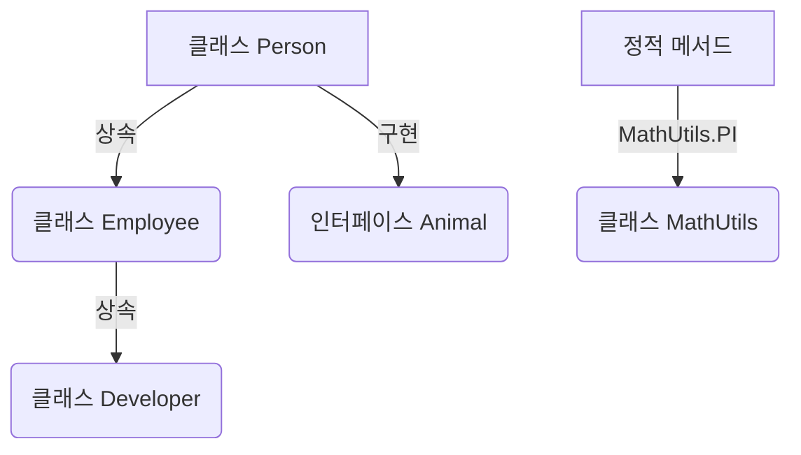

# 🎯 TypeScript 클래스와 객체지향 프로그래밍 (OOP)

## 📌 개요
TypeScript에서는 **클래스(Class)** 를 사용하여 객체지향 프로그래밍(OOP, Object-Oriented Programming)을 지원합니다. TypeScript의 클래스는 **속성, 생성자, 메서드, 접근 제어자, 상속, 인터페이스 구현** 등을 제공합니다. 이를 통해 **코드의 재사용성을 높이고 유지보수성을 개선**할 수 있습니다. 🚀

---

## 🏗 클래스 기본 구조
### ✅ 기본 클래스 선언
```typescript
class Person {
    name: string;
    age: number;

    constructor(name: string, age: number) {
        this.name = name;
        this.age = age;
    }

    greet(): string {
        return `Hello, my name is ${this.name} and I am ${this.age} years old.`;
    }
}

let person1 = new Person("Alice", 25);
console.log(person1.greet());
```
- `class Person` → 클래스 선언
- `constructor(name: string, age: number)` → 생성자(constructor)로 객체 초기화
- `greet()` → 클래스 내부 메서드
- `new Person("Alice", 25)` → 새로운 객체 생성

---

## 🔐 접근 제어자 (Access Modifiers)
TypeScript는 **`public`, `private`, `protected`** 세 가지 접근 제어자를 제공합니다.

### ✅ `public`: 어디서든 접근 가능 (기본값)
```typescript
class User {
    public username: string;
    constructor(username: string) {
        this.username = username;
    }
}

let user = new User("Charlie");
console.log(user.username); // ✅ 가능
```

### ✅ `private`: 클래스 내부에서만 접근 가능
```typescript
class BankAccount {
    private balance: number = 1000;
    
    getBalance(): number {
        return this.balance;
    }
}

let account = new BankAccount();
// console.log(account.balance); // ❌ 오류 발생 (private 속성 접근 불가)
console.log(account.getBalance()); // ✅ 가능
```

### ✅ `protected`: 상속받은 클래스에서 접근 가능
```typescript
class Animal {
    protected species: string;
    constructor(species: string) {
        this.species = species;
    }
}

class Dog extends Animal {
    bark(): void {
        console.log(`Woof! I am a ${this.species}.`);
    }
}

let dog = new Dog("Golden Retriever");
dog.bark();
```
- `species` 속성은 `protected`이므로 `Dog` 클래스에서 접근 가능

---

## 🔄 클래스 상속 (Inheritance)
```typescript
class Employee {
    name: string;
    constructor(name: string) {
        this.name = name;
    }
    work(): string {
        return `${this.name} is working.`;
    }
}

class Developer extends Employee {
    programmingLanguage: string;
    constructor(name: string, programmingLanguage: string) {
        super(name); // 부모 클래스 생성자 호출
        this.programmingLanguage = programmingLanguage;
    }
    code(): string {
        return `${this.name} is coding in ${this.programmingLanguage}.`;
    }
}

let dev = new Developer("Alice", "TypeScript");
console.log(dev.work()); // ✅ "Alice is working."
console.log(dev.code()); // ✅ "Alice is coding in TypeScript."
```
- `extends` 키워드를 사용하여 클래스를 확장할 수 있음
- `super(name)` → 부모 클래스 생성자를 호출하여 초기화

---

## 🔄 인터페이스 구현 (Implements)
클래스는 인터페이스를 구현(`implements`)하여 특정 구조를 강제할 수 있습니다.
```typescript
interface Animal {
    name: string;
    makeSound(): void;
}

class Cat implements Animal {
    name: string;
    constructor(name: string) {
        this.name = name;
    }
    makeSound(): void {
        console.log("Meow! Meow!");
    }
}

let myCat = new Cat("Whiskers");
myCat.makeSound(); // 출력: "Meow! Meow!"
```
- `implements` 키워드를 사용하여 인터페이스를 구현
- `makeSound()` 메서드를 반드시 구현해야 함

---

## 📌 정적 속성과 메서드 (Static Properties & Methods)
```typescript
class MathUtils {
    static PI: number = 3.14159;
    static circleArea(radius: number): number {
        return this.PI * radius * radius;
    }
}

console.log(MathUtils.PI); // ✅ 3.14159
console.log(MathUtils.circleArea(5)); // ✅ 78.53975
```
- `static` 키워드를 사용하면 인스턴스 생성 없이 클래스 자체에서 접근 가능

---

## 🔎 클래스 다이어그램


---

## 🎯 정리 및 다음 단계
✅ **클래스를 활용하면 코드의 구조를 명확하게 정의**할 수 있습니다.
✅ **접근 제어자(`public`, `private`, `protected`)를 사용하여 정보 은닉**이 가능합니다.
✅ **상속(`extends`)과 인터페이스(`implements`)를 활용하면 코드 재사용성이 높아집니다.**
✅ **정적 속성과 메서드를 사용하여 공통 기능을 클래스 자체에서 관리할 수 있습니다.**

👉 **다음 강의: [06-generics.md](./06-generics.md)**

