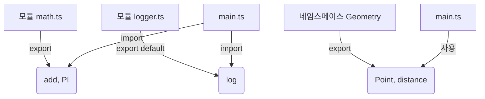

# 🎯 TypeScript 모듈과 네임스페이스 (Modules & Namespaces)

## 📌 개요
TypeScript에서는 **모듈(Modules)과 네임스페이스(Namespaces)** 를 활용하여 코드를 구조화하고 관리할 수 있습니다. 모듈은 **파일 단위의 코드 분리**를 지원하며, 네임스페이스는 **전역 스코프를 오염시키지 않고 코드 그룹을 구성**하는 데 유용합니다. 🚀

---

## 🏗 모듈 (Modules)
모듈은 **ES6 모듈 시스템을 기반으로 하며**, `import`와 `export`를 사용하여 파일 간에 기능을 공유합니다.

### ✅ 모듈 내보내기 (`export`)
```typescript
// math.ts
export function add(a: number, b: number): number {
    return a + b;
}
export const PI = 3.14159;
```

### ✅ 모듈 가져오기 (`import`)
```typescript
// main.ts
import { add, PI } from "./math";
console.log(add(5, 3)); // 출력: 8
console.log(PI); // 출력: 3.14159
```

### ✅ `default` 내보내기
```typescript
// logger.ts
export default function log(message: string) {
    console.log(`Log: ${message}`);
}
```
```typescript
// main.ts
import log from "./logger";
log("Hello, TypeScript!");
```
- `export default`는 하나의 값만 내보낼 때 사용
- 가져올 때 `{}` 없이 이름을 직접 사용 가능

### ✅ 전체 모듈 가져오기
```typescript
import * as MathUtils from "./math";
console.log(MathUtils.add(4, 2));
console.log(MathUtils.PI);
```

### ✅ 모듈 다시 내보내기 (`re-export`)
```typescript
// index.ts
export { add, PI } from "./math";
export { default as log } from "./logger";
```
```typescript
// main.ts
import { add, PI, log } from "./index";
```

---

## 🔄 네임스페이스 (Namespaces)
네임스페이스는 **전역 변수를 오염시키지 않으면서 코드 그룹을 정의**하는 방법입니다.

### ✅ 네임스페이스 선언
```typescript
namespace Geometry {
    export interface Point {
        x: number;
        y: number;
    }
    export function distance(p1: Point, p2: Point): number {
        let dx = p1.x - p2.x;
        let dy = p1.y - p2.y;
        return Math.sqrt(dx * dx + dy * dy);
    }
}
```

### ✅ 네임스페이스 사용
```typescript
let p1: Geometry.Point = { x: 0, y: 0 };
let p2: Geometry.Point = { x: 3, y: 4 };
console.log(Geometry.distance(p1, p2)); // 출력: 5
```

### ✅ 네임스페이스 별칭 사용
```typescript
import G = Geometry;
let p3: G.Point = { x: 5, y: 5 };
```

---

## 📌 모듈 vs 네임스페이스
| 특징 | 모듈 | 네임스페이스 |
|------|------|-------------|
| 사용 방식 | 파일 기반 | 전역 스코프 내부 그룹화 |
| ES6 지원 | ✅ (권장) | ❌ (구식 방식) |
| 파일 간 공유 | `import/export` | `namespace` 내부 `export` 사용 |
| 추천 용도 | 애플리케이션 개발 | 라이브러리 또는 전역 코드 관리 |

🚀 **모던 TypeScript 개발에서는 모듈을 사용하는 것이 권장됩니다!**

---

## 🔎 모듈과 네임스페이스 다이어그램


---

## 🎯 정리 및 다음 단계
✅ **모듈을 사용하면 코드의 재사용성이 높아지고 유지보수가 쉬워집니다.**
✅ **네임스페이스는 전역 환경을 오염시키지 않으면서 관련 기능을 그룹화하는 데 유용합니다.**
✅ **모던 TypeScript에서는 모듈(`import/export`)을 사용하는 것이 더 권장됩니다.**

👉 **다음 강의: [08-error-handling.md](./08-error-handling.md)**

