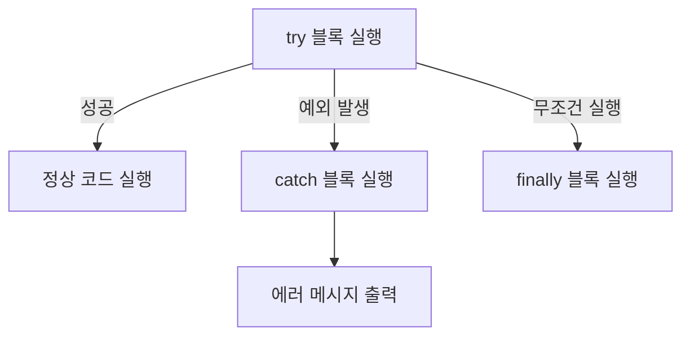

# 🎯 TypeScript 에러 처리 (Error Handling)

## 📌 개요
에러 처리는 애플리케이션의 안정성을 높이는 중요한 요소입니다. TypeScript에서는 **기본적인 예외 처리**, **사용자 정의 에러**, **에러 타입 정의**, **비동기 에러 처리** 등의 기능을 제공합니다. 🚀

---

## 🛠 기본 예외 처리 (`try-catch`)
JavaScript와 동일하게 `try-catch` 문을 사용하여 예외를 처리할 수 있습니다.

### ✅ 기본적인 `try-catch`
```typescript
try {
    let result = 10 / 0; // 0으로 나누기
    console.log(result);
    throw new Error("Something went wrong");
} catch (error) {
    console.log("Error caught:", error.message);
} finally {
    console.log("Execution completed");
}
```
- `throw new Error("Something went wrong")` → 오류를 강제로 발생
- `catch (error)` → 오류 메시지를 캡처하여 출력
- `finally` 블록 → 오류 여부와 관계없이 실행됨

---

## 📌 사용자 정의 에러
TypeScript에서는 `Error` 클래스를 상속하여 사용자 정의 에러를 만들 수 있습니다.

### ✅ 사용자 정의 에러 클래스
```typescript
class CustomError extends Error {
    constructor(message: string) {
        super(message);
        this.name = "CustomError";
    }
}

function riskyOperation(value: number) {
    if (value < 0) {
        throw new CustomError("Negative value is not allowed");
    }
    return value * 10;
}

try {
    console.log(riskyOperation(-5));
} catch (error) {
    if (error instanceof CustomError) {
        console.log("CustomError caught:", error.message);
    } else {
        console.log("Unknown error occurred");
    }
}
```
- `CustomError` 클래스는 `Error`를 확장하여 커스텀 에러를 정의
- `instanceof CustomError`를 사용하여 특정 에러 유형을 확인 가능

---

## 📌 타입을 활용한 에러 처리
TypeScript의 타입 시스템을 활용하여 예외 처리를 안전하게 만들 수 있습니다.

### ✅ `never` 타입을 활용한 예외 처리
```typescript
function throwError(message: string): never {
    throw new Error(message);
}
```
- `never` 타입을 사용하면 함수가 절대 반환되지 않음을 명확히 표시할 수 있음

### ✅ 에러 객체 타입 정의
```typescript
interface ApiError {
    message: string;
    statusCode: number;
}

function handleApiError(error: ApiError) {
    console.log(`Error ${error.statusCode}: ${error.message}`);
}

handleApiError({ message: "Unauthorized", statusCode: 401 });
```
- `ApiError` 인터페이스를 정의하여 API 에러 처리를 표준화 가능

---

## 🔄 비동기 에러 처리 (`async/await` + `try-catch`)
비동기 코드에서는 `async/await`을 사용할 때 예외 처리가 중요합니다.

### ✅ `async/await`에서 `try-catch` 사용
```typescript
async function fetchData(): Promise<string> {
    return new Promise((resolve, reject) => {
        setTimeout(() => reject(new Error("Network error")), 1000);
    });
}

async function fetchAndHandleData() {
    try {
        let data = await fetchData();
        console.log("Data received:", data);
    } catch (error) {
        console.log("Error caught:", error.message);
    }
}

fetchAndHandleData();
```
- `await fetchData()` 호출 시 발생할 수 있는 오류를 `try-catch`로 감싸서 안전하게 처리 가능

### ✅ `.catch()`를 활용한 에러 처리
```typescript
fetchData()
    .then(data => console.log("Data:", data))
    .catch(error => console.log("Error caught:", error.message));
```
- `.catch()`를 활용하면 비동기 코드의 예외를 처리할 수 있음

---

## 🔎 에러 처리 다이어그램


---

## 🎯 정리 및 다음 단계
✅ **`try-catch`를 사용하여 예외를 안전하게 처리**할 수 있습니다.
✅ **사용자 정의 에러 클래스를 활용하면 특정 오류를 쉽게 식별**할 수 있습니다.
✅ **비동기 코드에서는 `async/await`과 `try-catch`를 함께 사용하여 안정성을 높일 수 있습니다.**
✅ **TypeScript의 타입 시스템(`never`, `인터페이스`)을 활용하여 에러 처리 로직을 더 안전하게 만들 수 있습니다.**

👉 **다음 강의: [09-debugging-and-logging.md](./09-debugging-and-logging.md)**

