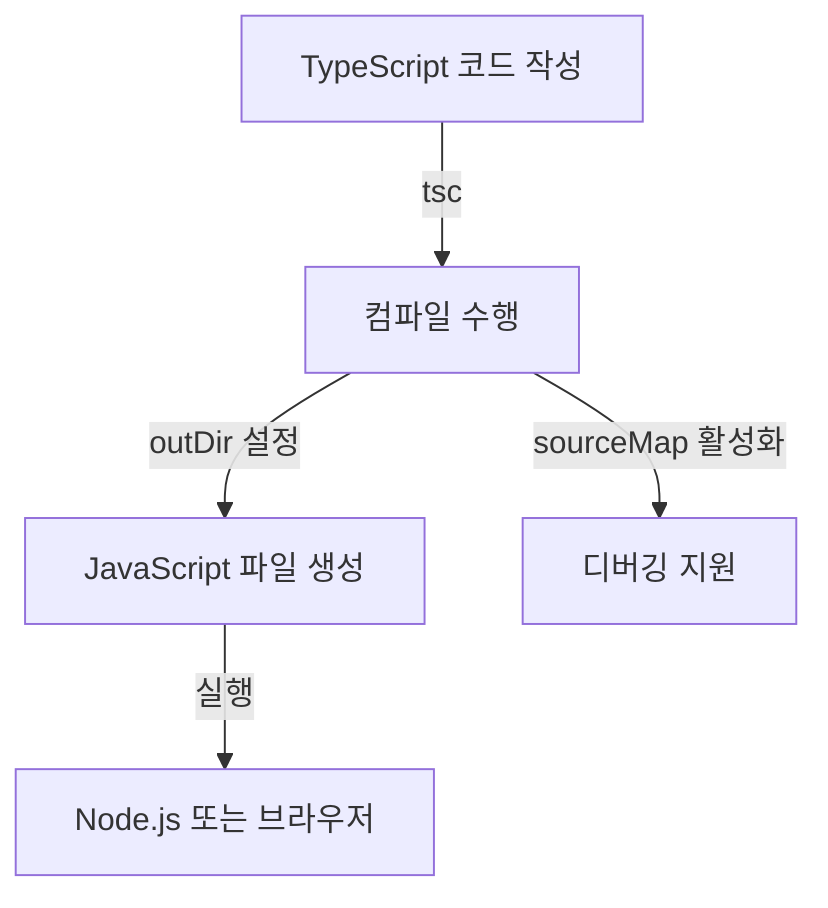

# 🎯 TypeScript 컴파일 및 설정 (Compilation & Config)

## 📌 개요
TypeScript 코드를 JavaScript로 변환하는 과정(컴파일)은 프로젝트의 효율성과 유지보수성을 높이는 중요한 요소입니다. `tsconfig.json` 설정을 통해 컴파일러 동작을 제어할 수 있으며, 다양한 빌드 도구와 통합하여 더욱 강력한 환경을 구성할 수 있습니다. 🚀

---

## 🛠 TypeScript 컴파일 기본

### ✅ TypeScript 컴파일러 설치
먼저 TypeScript가 설치되어 있어야 합니다.
```bash
npm install -g typescript
```

### ✅ TypeScript 코드 컴파일하기
```bash
tsc example.ts
```
위 명령어를 실행하면 `example.js` 파일이 생성됩니다.

---

## 🏗 `tsconfig.json` 설정
`tsconfig.json` 파일을 생성하면 프로젝트 전체를 TypeScript로 컴파일할 수 있습니다.

### ✅ `tsconfig.json` 생성
```bash
tsc --init
```
이 명령어를 실행하면 기본 설정이 포함된 `tsconfig.json` 파일이 생성됩니다.

### ✅ 주요 설정 옵션
| 옵션 | 설명 |
|------|------|
| `target` | 컴파일할 JavaScript 버전 (예: `ES6`, `ESNext`) |
| `module` | 모듈 시스템 지정 (`CommonJS`, `ESNext`) |
| `strict` | 엄격한 타입 검사 활성화 |
| `outDir` | 컴파일된 JS 파일 저장 위치 |
| `rootDir` | 소스 파일의 루트 디렉토리 지정 |
| `sourceMap` | 디버깅을 위한 소스맵 생성 |
| `noImplicitAny` | 암시적 `any` 타입 금지 |
| `allowJs` | JavaScript 파일도 컴파일 허용 |

```json
{
    "compilerOptions": {
        "target": "ES6",
        "module": "CommonJS",
        "strict": true,
        "outDir": "./dist",
        "rootDir": "./src",
        "sourceMap": true,
        "noImplicitAny": true,
        "allowJs": true
    }
}
```

이제 `tsc` 명령어를 실행하면 `src/` 디렉터리의 TypeScript 파일이 `dist/` 디렉터리에 JavaScript로 컴파일됩니다.

---

## 🔄 `tsconfig.json` 확장 및 프로젝트 구성

### ✅ 설정 확장 (`extends`)
기본 설정을 포함한 `base.tsconfig.json`을 만들고 확장할 수 있습니다.
```json
{
    "extends": "./base.tsconfig.json",
    "compilerOptions": {
        "noImplicitAny": false
    }
}
```

### ✅ 다중 프로젝트 관리 (`references`)
대규모 프로젝트에서는 여러 TypeScript 설정을 분리하여 관리할 수 있습니다.
```json
{
    "compilerOptions": {
        "composite": true
    },
    "references": [
        { "path": "./core" },
        { "path": "./frontend" }
    ]
}
```
이 방식은 **모노레포(Monorepo) 스타일의 프로젝트**에서 유용합니다.

---

## 🏗 TypeScript와 빌드 도구 통합

### ✅ `tsc --watch` (자동 컴파일)
개발 중 변경 사항을 자동으로 감지하여 컴파일하려면 다음 명령을 사용합니다.
```bash
tsc --watch
```

### ✅ `nodemon`과 함께 사용 (Node.js 프로젝트)
```bash
npm install --save-dev nodemon
```
`package.json`에 다음 스크립트를 추가합니다.
```json
{
    "scripts": {
        "dev": "tsc --watch & nodemon dist/index.js"
    }
}
```
이제 `npm run dev`를 실행하면 변경 사항이 감지될 때마다 자동으로 컴파일되고 서버가 재시작됩니다.

### ✅ `webpack`과 함께 사용 (프론트엔드 프로젝트)
TypeScript를 `webpack`과 함께 사용하려면 `ts-loader`를 설치해야 합니다.
```bash
npm install --save-dev webpack ts-loader
```
`webpack.config.js` 설정 예제:
```javascript
module.exports = {
    entry: "./src/index.ts",
    module: {
        rules: [{ test: /\.ts$/, use: "ts-loader", exclude: /node_modules/ }]
    },
    resolve: {
        extensions: [".ts", ".js"]
    },
    output: {
        filename: "bundle.js",
        path: __dirname + "/dist"
    }
};
```
이제 `webpack`을 실행하면 TypeScript 코드가 번들링됩니다.

---

## 🔎 TypeScript 컴파일 과정 다이어그램


---

## 🎯 정리 및 다음 단계
✅ **`tsc`를 사용하여 TypeScript를 JavaScript로 변환할 수 있습니다.**
✅ **`tsconfig.json`을 통해 프로젝트의 컴파일 동작을 제어할 수 있습니다.**
✅ **빌드 자동화를 위해 `watch mode`, `nodemon`, `webpack` 등의 도구와 통합할 수 있습니다.**

🎉 TypeScript의 기본 개념을 모두 학습했습니다! 🚀