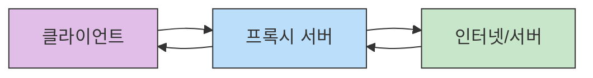
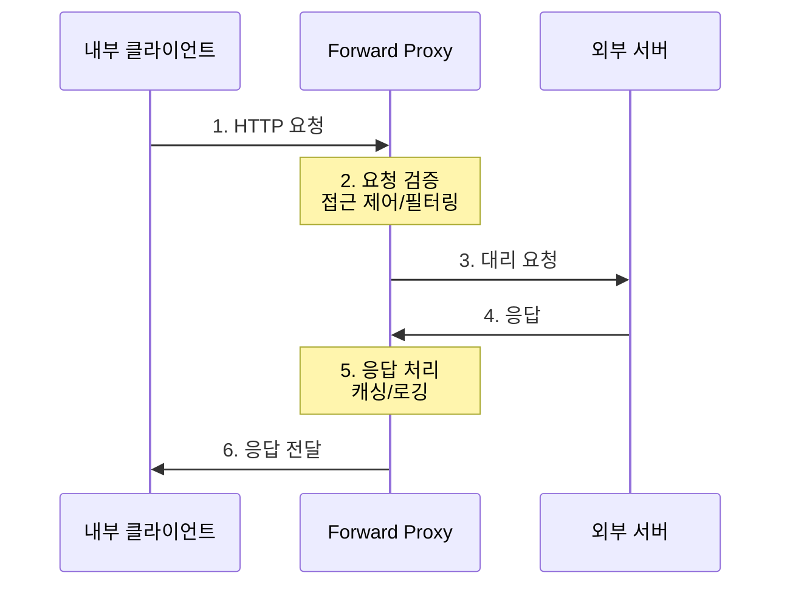
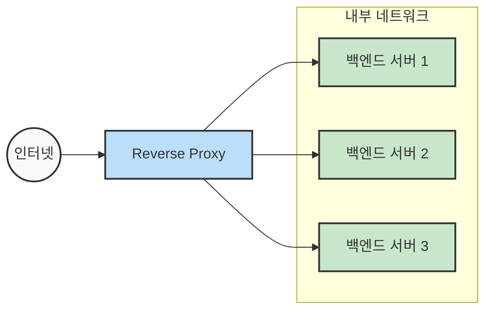
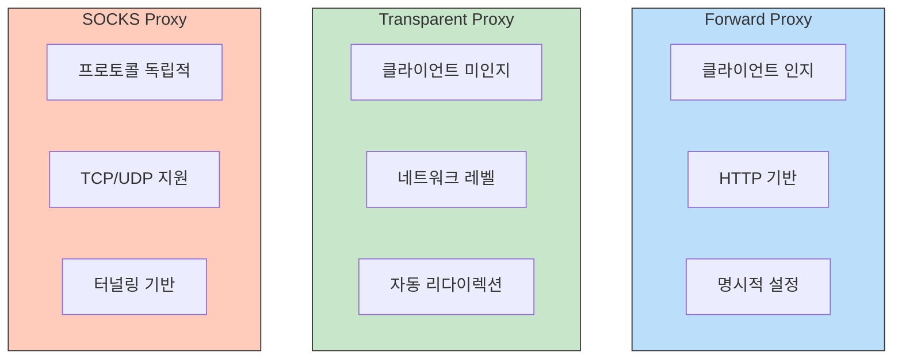
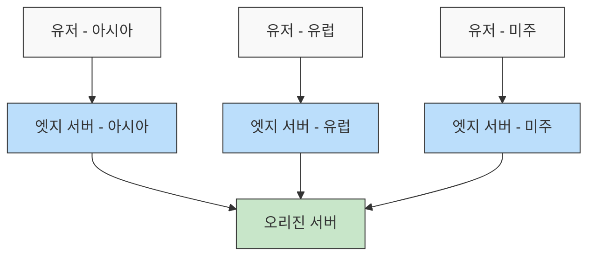

# 프록시 이해하기 (Proxy Details)

## 들어가기 (Introduction)

### 프록시의 중요성
현대 네트워크 아키텍처에서 프록시(Proxy)는 필수적인 중간 계층 역할을 수행합니다. 클라이언트와 서버 사이에서 중개자 역할을 하며, 다양한 부가 기능을 제공합니다.

### 현재 동향
- 기업의 방화벽과 보안 강화
- 웹 서비스의 로드 밸런싱 필수화
- CDN을 통한 글로벌 서비스 확장
- SSL/TLS 터미네이션 포인트로 활용

### 학습 목표
- 프록시의 기본 개념과 동작 원리 이해
- Forward Proxy와 Reverse Proxy의 차이점 파악
- 실무에서의 프록시 서버 설정 방법 습득
- 보안 및 성능 최적화 기법 학습

### 주요 활용 사례
- 기업: 내부 네트워크 보호 및 인터넷 사용 모니터링
- 웹 서비스: 트래픽 분산 및 SSL/TLS 인증서 관리
- CDN: 전 세계 사용자에게 콘텐츠 빠르게 전달
- 보안: 웹 방화벽(WAF) 및 DDoS 방어

## 프록시의 기본 개념

### 프록시란 무엇인가?
프로시 서버는 클라이언트와 서버 사이에서 중계 역할을 수행하는 서버입니다. 클라이언트를 대신하여 요청을 보내거나, 서버를 대신하여 응답을 처리하는 "대리인" 역할을 합니다.

#### 주요 특징
- 중개자 역할: 클라이언트와 서버 간의 통신을 중계
- IP 은닉: 출발지 또는 목적지의 IP 주소를 숨김
- 캐싱: 자주 요청되는 콘텐츠를 저장하여 응답 속도 향상
- 접근 제어: 특정 사이트나 콘텐츠에 대한 접근 통제

### 클라이언트와 서버 사이의 위치


### 프록시 유형 개관

#### Forward Proxy
- 클라이언트의 요청을 대신 전달
- 주로 내부 네트워크에서 사용
- 예시: 기업 방화벽, 학교/회사 인터넷 필터

#### Reverse Proxy
- 서버 앞단에서 요청을 받아 처리
- 실제 서버 보호 및 부하 분산
- 예시: 로드 밸런서, CDN, WAF

#### Transparent Proxy
- 클라이언트 설정 변경 불필요
- 네트워크 수준에서 자동 리다이렉션
- 예시: ISP 캐시 서버, 일부 방화벽

#### SOCKS Proxy
- TCP/UDP 레벨에서 동작
- 애플리케이션 프로토콜 독립적
- 예시: SSH 터널링, VPN 연결

## 순방향 프록시 (Forward Proxy)

### 동작 원리


#### 동작 단계
1. 클라이언트가 프록시 서버로 요청 전송
2. 프록시 서버는 요청을 검증하고 필터링
3. 프록시 서버가 외부 서버로 요청을 대신 전달
4. 외부 서버가 프록시 서버로 응답
5. 프록시 서버는 응답을 처리(캐싱, 로깅 등)
6. 프록시 서버가 클라이언트로 응답 전달

### 주요 활용

#### 보안 및 필터링
- 내부 네트워크 보호
- 악성 웹사이트 차단
- 콘텐츠 필터링
- 사용자 접근 로깅

#### 캐싱
- 자주 요청되는 콘텐츠 저장
- 네트워크 대역폭 절약
- 응답 시간 단축
- 외부 트래픽 감소

#### 익명성 제공
- 클라이언트 IP 주소 은닉
- 지리적 제한 우회
- 프라이버시 보호

### 구현 예시(Squid)

#### 기본 설정 예시
```nginx
# Squid 기본 설정
http_port 3128
cache_mem 256 MB
maximum_object_size 100 MB

# 접근 제어 설정
acl localnet src 10.0.0.0/8
http_access allow localnet
http_access deny all

# 캐시 설정
cache_dir ufs /var/spool/squid 100 16 256
```

#### 인증 설정 예시
```nginx
# 기본 인증 설정
auth_param basic program /usr/lib/squid/basic_ncsa_auth /etc/squid/passwd
auth_param basic realm Proxy Authentication Required
acl authenticated proxy_auth REQUIRED
http_access allow authenticated
```

## 역방향 프록시(Reverse Proxy)

### 동작 원리

- 실제 서버의 IP 주소와 아키텍처를 외부로부터 숨김
- DDoS 공격이나 악의적인 요청으로부터 백엔드 보호
- 민감한 내부 리소스에 대한 직접 접근 차단

#### 동작 과정
1. 외부 클라이언트가 도메인으로 접근(예: www.example.com)
2. DNS가 Reverse Proxy의 IP로 라우팅
3. Reverse Proxy가 요청을 적절한 내부 서버로 전달
4. 내부 서버가 처리 후 Proxy로 응답
5. Proxy가 클라이언트에게 최종 응답 전달

### 주요 활용

#### 로드 밸런싱
- 트래픽 분산
- 서버 헬스 체크
- 동적 서버 추가/제거
- 장애 서버 자동 제외

#### SSL/TLS 오프로딩
- 인증서 중앙 관리
- 암호화/복호화 부하 집중
- 내부 통신은 평문으로 처리
- 인증서 갱신 관리 용이

#### 캐싱 및 압축
- 정적 콘텐츠 캐싱
- 응답 압축 처리
- 콘텐츠 최적화
- 대역폭 사용 절감

#### 보안 관점의 이점
- 방화벽 정책 단순화(단일 진입점)
- 취약점 스캐닝 방어
- 백엔드 서버의 버전 정보 숨김
- 악성 페이로드 필터링

### 구현 예시(Nginx)

#### 기본 설정
```nginx
# Nginx Reverse Proxy 기본 설정
http {
    upstream backend {
        server backend1.example.com:8080;
        server backend2.example.com:8080;
        server backend3.example.com:8080;
    }

    server {
        listen 80;
        server_name example.com;

        location / {
            proxy_pass http://backend;
            proxy_set_header Host $host;
            proxy_set_header X-Real-IP $remote_addr;
            proxy_set_header X-Forwarded-For $proxy_add_x_forwarded_for;
        }
    }
}
```

#### SSL 설정
```nginx
# HTTPS 설정
server {
    listen 443 ssl;
    server_name example.com;

    ssl_certificate     /etc/nginx/ssl/example.com.crt;
    ssl_certificate_key /etc/nginx/ssl/example.com.key;
    
    ssl_protocols TLSv1.2 TLSv1.3;
    ssl_ciphers ECDHE-RSA-AES128-GCM-SHA256:ECDHE-ECDSA-AES128-GCM-SHA256;

    location / {
        proxy_pass http://backend;
        proxy_set_header X-Forwarded-Proto $scheme;
    }
}
```

## Transparent Proxy

### 특징
- 클라이언트가 프록시의 존재를 모름
- 네트워크 수준에서 자동으로 트래픽 리다이렉션
- 클라이언트 설정 변경 불필요
- ISP나 기업 네트워크에서 주로 사용

### 구현 예시
```bash
# iptables를 이용한 Transparent Proxy 설정
iptables -t nat -A PREROUTING -i eth0 -p tcp --dport 80 -j REDIRECT --to-port 3128
```
```nginx
# Squid Transparent Proxy 설정
http_port 3128 intercept
```

## SOCKS Proxy

### 특징
- TCP/UDP 레벨에서 동작
- 애플리케이션 프로토콜에 독립적
- 모든 종류의 트래픽 처리 가능
- SSH 터널링과 함께 자주 사용

### SOCKS 버전
- SOCKS4: TCP 연결만 지원
- SOCKS4a: 호스트명 확인 기능 추가
- SOCKS5: UDP 지원, 인증 기능 강화

### 일반적인 사용 사례
```bash
# SSH를 통한 SOCKS Proxy 설정
ssh -D 1080 username@remote-server

# Firefox에서 SOCKS Proxy 사용
# Settings -> Network Settings -> Manual proxy configuration
# SOCKS Host: localhost, Port: 1080
```

### 프록시 유형 비교


각각의 프록시 유형은 서로 다른 사용 사례와 장단점을 가지고 있습니다:

- Transparent Proxy는 대규모 네트워크에서 중앙 집중식 제어가 필요할 때 유용
- SOCKS Proxy는 특정 애플리케이션의 모든 트래픽을 터널링해야 할 때 효과적
- Forward Proxy는 explicit한 프록시 설정이 필요하지만 더 세밀한 제어가 가능

## 프록시 활용 사례

### 캐싱 프록시

#### Forward Caching
- 사내 사용자들이 자주 접근하는 외부 콘텐츠 캐싱
- 대역폭 사용량 감소
- 응답 시간 개선
- 캐시 적중률(Hit Ratio) 모니터링

#### Reverse Caching
- 정적 자원(이미지, CSS, JS 등) 캐싱
- 서버 부하 감소
- CDN과 연계
- 캐시 무효화(Cache Invalidation) 전략

```nginx
# Nginx 캐싱 설정 예시
proxy_cache_path /path/to/cache levels=1:2 keys_zone=my_cache:10m max_size=10g inactive=60m use_temp_path=off;

server {
    location / {
        proxy_cache my_cache;
        proxy_cache_use_stale error timeout http_500 http_502 http_503 http_504;
        proxy_cache_valid 200 60m;
        proxy_cache_key $scheme$request_method$host$request_uri;
    }
}
```

### 보안/필터링 프록시

#### 웹 방화벽(WAF) 기능
- SQL 인젝션 방지
- XSS 공격 차단
- 악성 봇 차단
- 요청 속도 제한

#### DLP(Data Loss Prevention)
- 민감 정보 유출 방지
- 파일 전송 모니터링
- 콘텐츠 검사
- 정책 기반 필터링

### CDN과 역방향 프록시

#### CDN 구조
- 엣지 로케이션(Edge Location)
- 오리진 서버(Origin Server)
- 글로벌 로드 밸런싱
- 지역별 캐싱



#### CDN 주요 기능
- 콘텐츠 전송 최적화
- SSL/TLS 인증서 관리
- DDoS 방어
- 실시간 분석과 모니터링

## 보안과 고급 설정

### SSL/TLS 오프로딩

#### 개념
- 프록시 서버에서 SSL/TLS 암호화/복호화 처리
- 백엔드 서버의 부하 감소
- 인증서 중앙 관리 용이
- 내부 통신은 암호화 없이 처리 가능

#### Nginx SSL 설정 예시
```nginx
# SSL 설정
server {
    listen 443 ssl http2;
    server_name example.com;

    # 인증서 설정
    ssl_certificate /etc/nginx/ssl/example.com.crt;
    ssl_certificate_key /etc/nginx/ssl/example.com.key;
    
    # SSL 최적화
    ssl_session_cache shared:SSL:10m;
    ssl_session_timeout 10m;
    ssl_protocols TLSv1.2 TLSv1.3;
    ssl_prefer_server_ciphers on;
    
    # HSTS 설정
    add_header Strict-Transport-Security "max-age=31536000" always;
}
```

### 인증/인가

#### Basic Authentication
```nginx
# Basic Auth 설정
location /admin {
    auth_basic "Restricted Access";
    auth_basic_user_file /etc/nginx/.htpasswd;
    proxy_pass http://backend;
}
```

#### OAuth2 Proxy 설정
```yaml
# OAuth2 Proxy 설정
oauth2_proxy:
  config:
    client_id: "your_client_id"
    client_secret: "your_client_secret"
    cookie_secret: "random_string"
    email_domains: ["yourdomain.com"]
    upstream: "http://your-application:8080"
```

### WAF(웹 방화벽) 연계

#### ModSecurity 설정
```nginx
# ModSecurity 기본 설정
modsecurity on;
modsecurity_rules_file /etc/nginx/modsecurity/main.conf;

# OWASP Core Rule Set
include /etc/nginx/modsecurity/crs/crs-setup.conf;
include /etc/nginx/modsecurity/crs/rules/*.conf;
```

#### 주요 보안 규칙
- SQL 인젝션 방지
- XSS 공격 차단
- 파일 업로드 제한
- 요청 속도 제한(Rate Limiting)
```nginx
# Rate Limiting 설정
limit_req_zone $binary_remote_addr zone=one:10m rate=1r/s;

location /api/ {
    limit_req zone=one burst=5 nodelay;
    proxy_pass http://backend;
}
```

## 프록시 서버 실습 및 명령어

### Squid/Nginx Reverse Proxy 설정 예시

#### Squid Forward Proxy 설정
```bash
# Squid 설치
sudo apt-get install squid

# 기본 설정 파일 위치
sudo vi /etc/squid/squid.conf
```
```bash
# Squid 기본 설정
http_port 3128
cache_mem 256 MB

# 접근 제어
acl localnet src 10.0.0.0/8
http_access allow localnet
http_access deny all

# 로깅 설정
access_log /var/log/squid/access.log
cache_log /var/log/squid/cache.log
```

#### Nginx Reverse Proxy 설정
```nginx
# 업스트림 서버 정의
upstream backend_servers {
    server backend1.example.com:8080 weight=3;
    server backend2.example.com:8080 weight=2;
    server backend3.example.com:8080 weight=1 backup;
}

server {
    listen 80;
    server_name example.com;

    # 프록시 설정
    location / {
        proxy_pass http://backend_servers;
        proxy_set_header Host $host;
        proxy_set_header X-Real-IP $remote_addr;
        
        # 타임아웃 설정
        proxy_connect_timeout 60s;
        proxy_send_timeout 60s;
        proxy_read_timeout 60s;
    }
}
```

### 모니터링/로그 분석

#### Access Log 분석
```bash
# Squid 로그 분석
tail -f /var/log/squid/access.log

# Nginx 로그 분석
tail -f /var/log/nginx/access.log

# 자주 사용되는 로그 분석 명령어
grep 'HTTP/1.1" 500' access.log  # 500 에러 찾기
awk '{print $9}' access.log | sort | uniq -c  # 상태 코드별 카운트
```

#### 성능 모니터링
```bash
# 프록시 서버 상태 확인
netstat -ntlp  # 활성 연결 확인
htop  # 시스템 리소스 사용량
pidstat  # 프로세스별 CPU 사용량
```

### 트러블슈팅: X-Forward-For, 헤더 처리

#### 헤더 설정
```nginx
# X-Forwarded-For 헤더 설정
proxy_set_header X-Forwarded-For $proxy_add_x_forwarded_for;
proxy_set_header X-Forwarded-Proto $scheme;
proxy_set_header X-Forwarded-Host $host;
```

#### 일반적인 문제 해결
```bash
# SSL 인증서 확인
openssl s_client -connect example.com:443 -servername example.com

# DNS 확인
dig example.com
nslookup example.com

# 연결 테스트
curl -v -x proxy.example.com:3128 http://target.com
```

#### 디버깅 설정
```nginx
# Nginx 디버그 로그 활성화
error_log /var/log/nginx/error.log debug;

# Squid 디버그 설정
debug_options ALL,1
```

## 요약 (Summary)

### 주요 프록시 유형별 특징

#### Forward Proxy
- 내부 클라이언트의 외부 접근을 대리
- 보안과 접근 제어에 초점
- 캐싱을 통한 대역복 절감
- 클라이언트 익명성 제공

#### Reverse Proxy
- 외부 요청에 대한 내부 서버 보호
- 로드 밸런싱과 고가용성 제공
- SSL/TLS 종단점 역할
- API Gateway와의 연계 가능

#### 기타 프록시
- Transparent Proxy: 클라이언트 설정 불필요
- SOCKS Proxy: 프로토콜 독립적 동작

### 핵심 활용 사례

#### 보안
- 내부 네트워크 보호
- WAF 통합
- DDoS 방어
- 접근 제어

#### 성능
- 로드 밸런싱
- 콘텐츠 캐싱
- SSL 오프로딩
- 압축 처리

#### 관리
- 중앙화된 인증/인가
- 트래픽 모니터링
- 로깅과 감사
- 정책 적용

### 실무 적용시 주의사항
- 적절한 프록시 유형 선택
- 보안 설정 강화
- 성능 모니터링
- 로그 관리와 분석
- 장애 대비 구성

## 참고 자료 (References)

### 공식 문서

#### 프록시 서버
- Nginx Documentation
- Squid Configuration Guide
- HAProxy Documentation
- Envoy Proxy Documentation

#### 관련 표준
- RFC 7230-7235: HTTP/1.1
- RFC 7540: HTTP/2
- RFC 9000: QUIC (HTTP/3)

### 추천 도서
- "Nginx: From Beginner to Pro"
- "HAProxy: The Complete Guide"
- "Building Microservices" (프록시/API Gateway 관련 챕터)
- "Web Performance in Action" (캐싱/프록시 최적화)