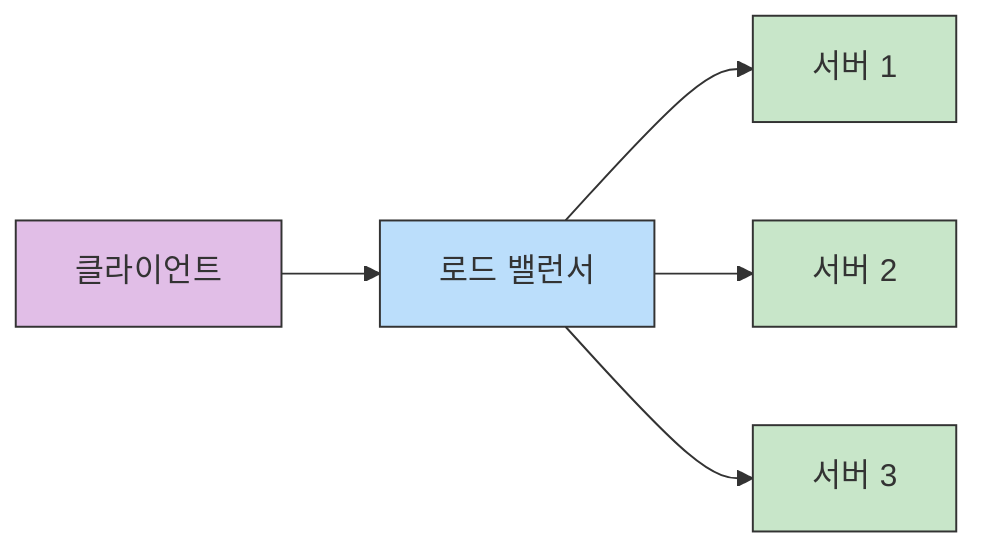
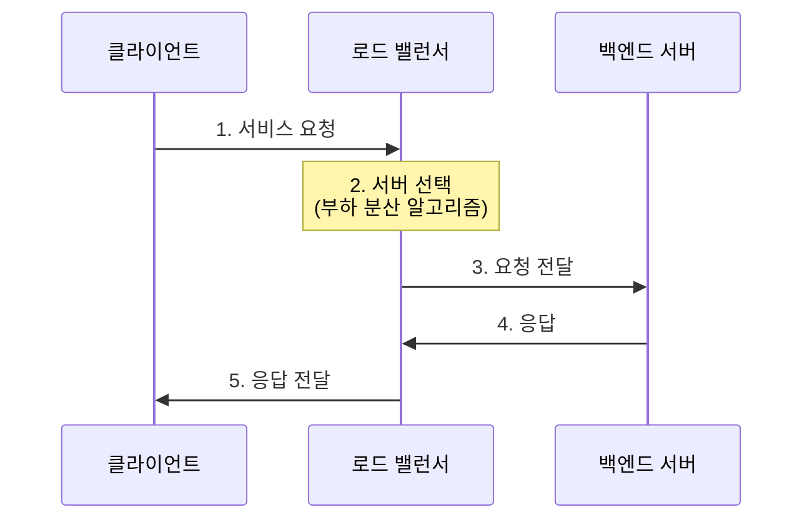
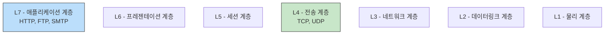
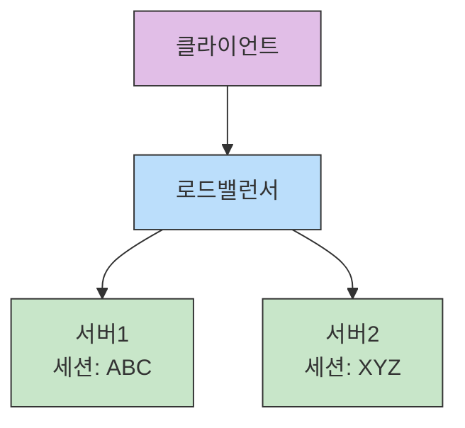
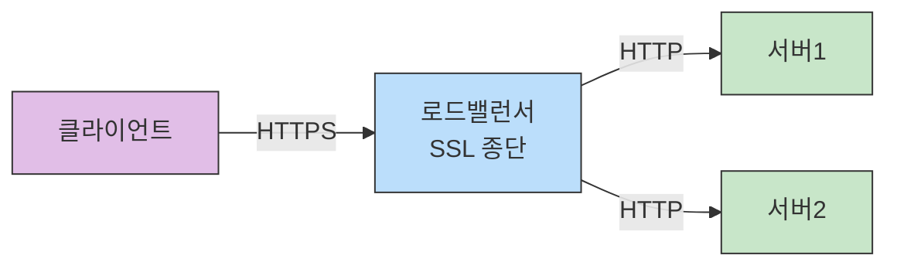
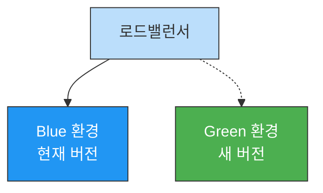
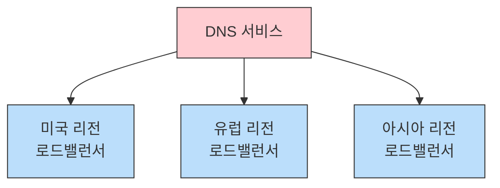
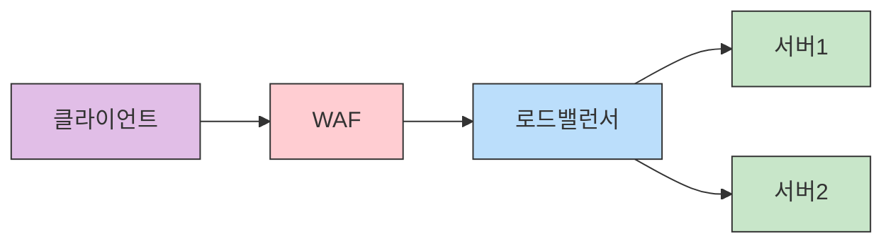

# 로드밸런싱 이해하기(Load Balancing in Details)

## 들어가기 (Introduction)

### 로드밸런싱의 중요성
현대의 대규모 웹 서비스에서 로드 밸런싱은 필수적인 인프라 구성 요소입니다. 트래픽을 여러 서버에 효과적으로 분산하고, 시스템의 안정성과 가용성을 보장하는 핵심 기술로 자리잡고 있습니다.

### 현재 동향
- 클라우드 네이티브 환경에서의 로드밸런싱 필수화
- 마이크로서비스 아키텍처의 확산으로 인한 중요성 증가
- 컨테이너 환경에서의 동적 로드밸런싱 요구
- 글로벌 서비스를 위한 지역 분산 로드밸런싱

### 학습 목표
- 로드밸런싱의 기본 개념과 동작 원리 이해
- L4/L7 로드밸런싱의 차이점 파악
- 실무에서의 로드밸런서 구성 방법 습득
- 로드밸런싱 알고리즘과 고급 설정 학습

### 주요 활용 사례
- 웹 서비스: 다수의 웹 서버 간 트래픽 분산
- 데이터베이스: 읽기 작업 분산을 통한 성능 향상
- 마이크로서비스: 서비스 간 통신 로드밸런싱
- 클라우드: 글로벌 트래픽의 지역적 분산

## 로드밸런싱 개념

### 로드 밸런서란 무엇인가?
로드 밸런서는 여러 서버나 네트워크 리소스에 작업 부하를 분산하는 장치 또는 소프트웨어입니다. 클라이언트의 요청을 받아 사전 정의된 규칙과 알고리즘에 따라 가용 가능한 서버로 트래픽을 분배합니다.

#### 주요 특징
- 트래픽 분산: 다수의 서버에 부하를 균등하게 배분
- 고가용성 보장: 서버 장애 시 자동 감지 및 제외
- 확장성 제공: 서버 추가/제거의 유연한 대응
- 세션 관리: 사용자 세션의 연속성 보장

### 로드 밸런서의 배치


### 로드 밸런서 유형

#### 하드웨어 로드 밸런서
- 전용 장비를 통한 구현
- F5, Citrix NetScaler 등
- 고성능, 안정성 보장
- 높은 초기 도입 비용

#### 소프트웨어 로드 밸런서
- 일반 서버에 소프트웨어 설치
- HAProxy, NGINX, Envoy
- 유연한 구성과 확장
- 비용 효율적인 구현

#### 클라우드 로드 밸런서
- 클라우드 제공업체의 관리형 서비스
- AWS ELB, GCP Load Balancing
- 자동 스케일링 지원
- 서버리스 운영 가능

### 기본 동작 원리


#### 동작 단계
1. 클라이언트가 서비스 요청
2. 로드밸런서가 부하 분산 알고리즘에 따라 서버 선택
3. 선택된 서버로 요청 전달
4. 서버가 요청 처리 후 응답
5. 클라이언트로 최종 응답 전달

## L4 vs L7 로드밸런싱

### OSI 7계층과 로드 밸런서


### L4 로드 밸런싱

#### 주요 특징
- TCP/UDP 포트 정보만으로 서버 분배
- 패킷 레벨의 로드밸런싱 수행
- 빠른 처리 속도와 높은 성능
- 단순하지만 효율적인 구조

#### 동작 방식
```haproxy
# L4 로드밸런서 설정 예시 (HAProxy)
frontend tcp-in
    bind *:80
    mode tcp
    default_backend tcp-servers

backend tcp-servers
    mode tcp
    balance roundrobin
    server web1 10.0.0.1:80 check
    server web2 10.0.0.2:80 check
```

### L7 로드밸런싱

#### 주요 특징
- HTTP 헤더, URL, 쿠키 기반 분배
- 콘텐츠 기반의 스위칭 가능
- SSL 터미네이션 수행 가능
- 애플리케이션 레벨 라우팅

#### 동작 방식
```nginx
# L7 로드밸런서 설정 예시 (NGINX)
http {
    upstream backend_api {
        server 10.0.0.1:8080;
        server 10.0.0.2:8080;
    }

    upstream backend_static {
        server 10.0.0.3:8080;
        server 10.0.0.4:8080;
    }

    server {
        listen 80;
        server_name example.com;

        location /api/ {
            proxy_pass http://backend_api;
        }

        location /static/ {
            proxy_pass http://backend_static;
        }
    }
}
```

### L4와 L7의 비교

#### 처리 성능
- L4: 패킷 레벨 처리로 높은 성능
- L7: 헤더 분석으로 인한 추가 부하

#### 라우팅 유연성
- L4: IP/Port 기반의 제한된 라우팅
- L7: URL, 헤더, 쿠키 등 다양한 조건

#### 주요 사용 사례
- L4: 단순한 TCP 부하 분산
- L7: 마이크로서비스, API 게이트웨이

#### 보완 기능
- L4: 기본적인 네트워크 수준 보안
- L7: WAF, SSL 처리, 콘텐츠 필터링

## 로드밸런싱 알고리즘과 기법

### 주요 로드밸런싱 알고리즘

#### 라운드 로빈(Round Robin)
- 서버들에 순차적으로 요청을 분배
- 가장 단순하고 널리 사용되는 방식
- 모든 서버의 성능이 동일할 때 적합
```nginx
upstream backend {
    server server1.example.com;
    server server2.example.com;
    server server3.example.com;
```

#### 가중치 기반 라운드 로빈(Weightd Round Robin)
- 서버별 가중치를 설정하여 차등 분배
- 서버 성능 차이를 고려한 부하 분산
- 하이브리드 환경에서 유용
```nginx
upstream backend {
    server server1.example.com weight=5;  # 높은 성능 서버
    server server2.example.com weight=3;  # 중간 성능 서버
    server server3.example.com weight=2;  # 낮은 성능 서버
}
```

#### 최소 연결 방식(Least Connection)
- 현재 연결이 가장 적은 서버로 요청 전달
- 동적인 부하 분산에 효과적
- 긴 세션 처리에 적합
```nginx
upstream backend {
    least_conn;  # 최소 연결 방식 활성화
    server server1.example.com;
    server server2.example.com;
    server server3.example.com;
}
```

### 세션 관리 기법

#### 세션 지속성 (Session Persistence)


#### 구현 방식
```nginx
# NGINX 세션 지속성 설정
upstream backend {
    ip_hash;  # 클라이언트 IP 기반 할당
    server server1.example.com;
    server server2.example.com;
}

# 쿠키 기반 세션 지속성
upstream backend {
    server server1.example.com;
    server server2.example.com;
    sticky cookie srv_id expires=1h domain=.example.com path=/;
}
```

### 헬스 체크 (Health Check)

#### 주요 체크 항목
- TCP 연결 확인
- HTTP 응답 코드 확인
- 사용자 정의 스크립트 실행
- 리소스 사용량 모니터링
```nginx
# NGINX 헬스 체크 설정
upstream backend {
    server server1.example.com:80 max_fails=3 fail_timeout=30s;
    server server2.example.com:80 max_fails=3 fail_timeout=30s;

    check interval=3000 rise=2 fall=5 timeout=1000 type=http;
    check_http_send "HEAD / HTTP/1.0\r\n\r\n";
    check_http_expect_alive http_2xx http_3xx;
}
```

### 성능 최적화 기법

#### 연결 풀링(Connection Pooling)
- 백엔드 서버와의 연결 재사용
- 연결 생성/종료 오버헤드 감소
- 리소스 효율성 향상

#### 버퍼링과 캐싱
```nginx
# NGINX 버퍼링 설정
location / {
    proxy_buffering on;
    proxy_buffer_size 4k;
    proxy_buffers 8 8k;
    proxy_busy_buffers_size 16k;
}
```

## 실무 구현 예시

### HAProxy 설정

#### 기본 구성
```conf
# HAProxy 기본 설정
global
    maxconn 50000
    log /dev/log local0
    user haproxy
    group haproxy

defaults
    log global
    mode http
    timeout connect 5000ms
    timeout client 50000ms
    timeout server 50000ms
    option dontlognull
    option http-server-close
    option forwardfor
    option redispatch
```

#### 웹 서버 로드밸런싱 설정
```conf
frontend http_front
    bind *:80
    stats uri /haproxy?stats
    default_backend http_back

backend http_back
    balance roundrobin
    option httpchk HEAD / HTTP/1.1\r\nHost:\ localhost
    server web1 10.0.0.1:80 check
    server web2 10.0.0.2:80 check
    server web3 10.0.0.3:80 check backup
```

### Nginx 로드밸런서 설정

#### HTTP 로드밸런싱
```nginx
http {
    upstream backend {
        least_conn;                 # 최소 연결 방식
        server backend1.example.com weight=3;
        server backend2.example.com weight=2;
        server backend3.example.com backup;
    }

    server {
        listen 80;
        server_name example.com;

        location / {
            proxy_pass http://backend;
            proxy_set_header Host $host;
            proxy_set_header X-Real-IP $remote_addr;
            proxy_set_header X-Forwarded-For $proxy_add_x_forwarded_for;
        }
    }
}
```

#### TCP/UDP 로드밸런싱
```nginx
stream {
    upstream stream_backend {
        server backend1.example.com:12345;
        server backend2.example.com:12345;
    }

    server {
        listen 12345;
        proxy_pass stream_backend;
    }
}
```

### 클라우드 로드밸런서

#### AWS ELB 구성
```json
{
    "Type": "AWS::ElasticLoadBalancingV2::LoadBalancer",
    "Properties": {
        "Name": "my-application-lb",
        "Subnets": ["subnet-12345678", "subnet-87654321"],
        "SecurityGroups": ["sg-12345678"],
        "Type": "application"
    }
}
```

#### 대상 그룹 설정
```json
{
    "Type": "AWS::ElasticLoadBalancingV2::TargetGroup",
    "Properties": {
        "Name": "my-targets",
        "Port": 80,
        "Protocol": "HTTP",
        "VpcId": "vpc-12345678",
        "HealthCheckEnabled": true,
        "HealthCheckIntervalSeconds": 30,
        "HealthCheckPath": "/health",
        "HealthyThresholdCount": 2,
        "UnhealthyThresholdCount": 3
    }
}
```

### 모니터링 및 로그 설정

#### HAProxy 모니터링
```conf
listen stats
    bind *:8404
    stats enable
    stats uri /monitor
    stats refresh 5s
    stats show-node
    stats show-legends
    stats auth admin:password
```

#### Nginx 모니터링
```nginx
location /nginx_status {
    stub_status on;
    access_log off;
    allow 127.0.0.1;
    deny all;
}
```

## 고급 토픽

### SSL/TLS 오프로딩


#### 구현 예시
```nginx
# NGINX SSL 설정
server {
    listen 443 ssl http2;
    server_name example.com;

    ssl_certificate     /etc/nginx/ssl/example.com.crt;
    ssl_certificate_key /etc/nginx/ssl/example.com.key;
    
    ssl_protocols TLSv1.2 TLSv1.3;
    ssl_ciphers ECDHE-RSA-AES128-GCM-SHA256:ECDHE-ECDSA-AES128-GCM-SHA256;
    
    location / {
        proxy_pass http://backend;
    }
}
```

### Blue-Green 배포

#### 구성도


#### 구현 예시
```nginx
# NGINX Blue-Green 설정
upstream blue {
    server blue1.example.com:80;
    server blue2.example.com:80;
}

upstream green {
    server green1.example.com:80;
    server green2.example.com:80;
}

server {
    listen 80;
    server_name example.com;

    location / {
        proxy_pass http://blue;  # 현재 활성 환경
    }
}
```

### 지역 기반 로드밸런싱

#### 구성도


#### AWS Route 53 설정 예시
```json
{
    "Type": "AWS::Route53::RecordSet",
    "Properties": {
        "HostedZoneName": "example.com.",
        "Name": "www.example.com.",
        "Type": "A",
        "SetIdentifier": "Asia Pacific",
        "Region": "ap-northeast-1",
        "AliasTarget": {
            "DNSName": "alb-asia.example.com",
            "HostedZoneId": "Z32O12XQLNTSW2",
            "EvaluateTargetHealth": true
        }
    }
}
```

### 장애 감지와 오토스케일링

#### 헬스 체크 설정
```yaml
# AWS ALB 타겟 그룹 헬스 체크
HealthCheck:
  HealthyThresholdCount: 2
  Interval: 30
  Matcher:
    HttpCode: 200
  Path: /health
  Port: traffic-port
  Protocol: HTTP
  TimeoutSeconds: 5
  UnhealthyThresholdCount: 2
```

#### 오토 스케일링 정책
```json
{
    "Type": "AWS::AutoScaling::ScalingPolicy",
    "Properties": {
        "AutoScalingGroupName": {"Ref": "WebServerGroup"},
        "PolicyType": "TargetTrackingScaling",
        "TargetTrackingConfiguration": {
            "PredefinedMetricSpecification": {
                "PredefinedMetricType": "ASGAverageCPUUtilization"
            },
            "TargetValue": 70.0
        }
    }
}
```

## 로드밸런싱 보안과 모니터링

### WAF(Web Application Firewall) 연계

#### WAF 통합 구성


#### ModSecurity 설정 예시
```nginx
# NGINX ModSecurity 설정
http {
    modsecurity on;
    modsecurity_rules_file /etc/nginx/modsecurity/main.conf;
    
    # OWASP Core Rule Set
    include /etc/nginx/modsecurity/crs/crs-setup.conf;
    include /etc/nginx/modsecurity/crs/rules/*.conf;
}
```

### 로그/메트릭 모니터링

#### 로그 수집 설정
```nginx
# NGINX 접근 로그 설정
http {
    log_format detailed '$remote_addr - $remote_user [$time_local] '
                       '"$request" $status $body_bytes_sent '
                       '"$http_referer" "$http_user_agent" '
                       '$request_time $upstream_response_time';

    access_log /var/log/nginx/access.log detailed;
}
```

#### 프로메테우스 메트릭 수집
```yaml
# 프로메테우스 설정
scrape_configs:
  - job_name: 'loadbalancer'
    static_configs:
      - targets: ['lb:9090']
    metrics_path: /metrics
    scheme: http
    scrape_interval: 15s
```

### DDoS 방어

#### 기본 보안 설정
```nginx
# NGINX 레이트 리미팅
http {
    limit_req_zone $binary_remote_addr zone=one:10m rate=10r/s;
    
    server {
        location / {
            limit_req zone=one burst=20 nodelay;
        }
    }
}
```

#### AWS Shield 설정
```json
{
    "Type": "AWS::Shield::Protection",
    "Properties": {
        "Name": "ALB Protection",
        "ResourceArn": {"Ref": "LoadBalancerArn"},
        "ProtectionName": "ALB-Protection"
    }
}
```

### 모니터링 대시보드

#### Grafana 대시보드 설정
```json
{
    "panels": [
        {
            "title": "요청 처리량",
            "type": "graph",
            "datasource": "Prometheus",
            "targets": [
                {
                    "expr": "rate(nginx_http_requests_total[5m])",
                    "legendFormat": "{{server}}"
                }
            ]
        },
        {
            "title": "응답 시간",
            "type": "graph",
            "targets": [
                {
                    "expr": "nginx_http_request_duration_seconds"
                }
            ]
        }
    ]
}
```

#### 알림 설정
```yaml
# 알림 규칙
alerting_rules:
  - alert: HighLatency
    expr: nginx_http_request_duration_seconds > 1
    for: 5m
    labels:
      severity: warning
    annotations:
      summary: "High latency detected"
      description: "Request latency is above 1 second"
```

## 요약 (Summary)

### 핵심 개념 정리

#### 로드밸런싱의 기본
- 트래픽 분산을 통한 서버 부하 균등화
- 고가용성과 확장성 확보
- L4/L7 레벨의 다양한 로드밸런싱 지원
- 효율적인 리소스 활용과 성능 최적화

#### 주요 구현 방식
- 하드웨어 로드밸런서: F5, NetScaler
- 소프트웨어 로드밸런서: HAProxy, NGINX
- 클라우드 로드밸런서: AWS ELB, GCP Load Balancer

#### 핵심 기술 요소
- 다양한 로드밸런싱 알고리즘
- 세션 유지와 헬스 체크
- SSL/TLS 오프로딩
- Blue-Green 배포 지원

### Key Takeaways
- 로드밸런서는 현대 웹 아키텍처의 필수 요소
- 적절한 알고리즘 선택이 성능에 큰 영향
- 보안과 모니터링의 중요성
- 클라우드 환경에서의 유연한 확장성

## 참조 자료 (References)

### 공식 문서
- HAProxy Documentation
- NGINX Documentation
- AWS ELB Documentation
- Kubernetes Service & Ingress

### 추천 도서
- "Load Balancing in the Cloud"
- "NGINX Cookbook"
- "HAProxy: The Complete Guide"
- "Cloud Native Infrastructure"