# 클라우드 환경에서의 네트워크 기초 (Cloud Networking in Details)

## 들어가기 (Introduction)

### 클라우드 네트워크의 중요성
클라우드 컴퓨팅 시대에서 네트워크는 단순한 연결 수단을 넘어 인프라의 핵심 요소가 되었습니다. 소프트웨어로 정의되는 네트워크는 유연성과 확장성을 제공하며, 기업의 디지털 전환을 가속화하는 핵심 동력이 되고 있습니다.

### 현재 동향
- 하이브리드/멀티 클라우드 네트워크 확산
- 컨테이너와 마이크로서비스 아키텍처 보편화
- Zero Trust 보안 모델 채택 증가
- 글로벌 엣지 컴퓨팅 확대

### 학습 목표
- 클라우드 네트워크의 기본 구조와 작동 원리 이해
- VPC, 서브넷, 게이트웨이 등 핵심 구성 요소의 역할 파악
- 멀티 AZ/리전 네트워크 설계 방법론 습득
- 보안 및 성능 최적화 기법 학습

### 주요 활용 사례
- 기업: 하이브리드 클라우드 네트워킹
- 웹 서비스: 글로벌 트래픽 분산
- DevOps: 자동화된 네트워크 프로비저닝
- 보안: 마이크로세그멘테이션 및 접근 제어

## 클라우드 네트워크 기초

### 가상화 기반 네트워크란?

클라우드의 네트워크는 소프트웨어 정의 네트워킹(SDN) 기술을 기반으로 합니다. 물리적인 네트워크 장비와 케이블이 소프트웨어로 추상화되어, API나 콘솔을 통해 자유롭게 구성하고 관리할 수 있습니다.

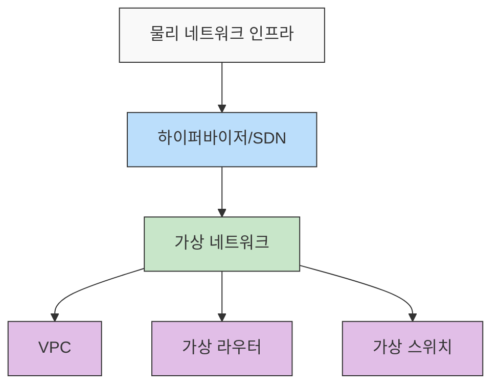

### 주요 특징

#### 동적 프로비저닝
- API 기반의 자동화된 네트워크 구성
- 인프라를 코드로 관리(IaC)
- 실시간 확장/축소 지원
- 자동화된 장애 복구

#### 멀티테넌시
- 물리적 인프라 공유
- 테넌트 간 완벽한 격리
- 독립적인 IP 주소 공간
- 자체 라우팅/방화벽 정책

#### 글로벌 인프라
- 리전(Region): 지리적으로 독립된 데이터센터 군
- 가용영역(AZ): 리전 내 물리적으로 격리된 데이터센터
- 엣지 로케이션: CDN과 글로벌 로드밸런싱을 위한 거점
- 글로벌 네트워크 백본: 리전 간 고속 연결

### 클라우드 네트워크 계층
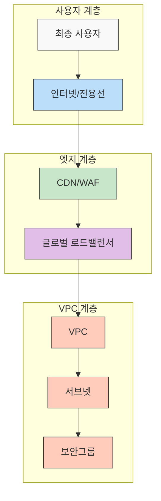

#### 물리 네트워크 계층
- 데이터센터 간 연결
- 리전 간 전용 백본
- 하드웨어 스위치/라우터
- ISP와의 상호 연결

#### 가상 네트워크 계층
- VPC 및 서브넷
- 가상 라우터/방화벽
- 소프트웨어 로드밸런서
- NAT/게이트웨이

## VPC(가상 사설망) 개념

### VPC란?
VPC(Virtual Private Cloud)는 클라우드 환경에서 생성하는 논리적으로 격리된 가상 네트워크입니다. 사용자는 VPC 내에서 IP 대역을 지정하고, 서브넷을 구성하며, 라우팅 테이블과 네트워크 게이트웨이를 설정할 수 있습니다.

### VPC의 핵심 특징

#### 네트워크 격리
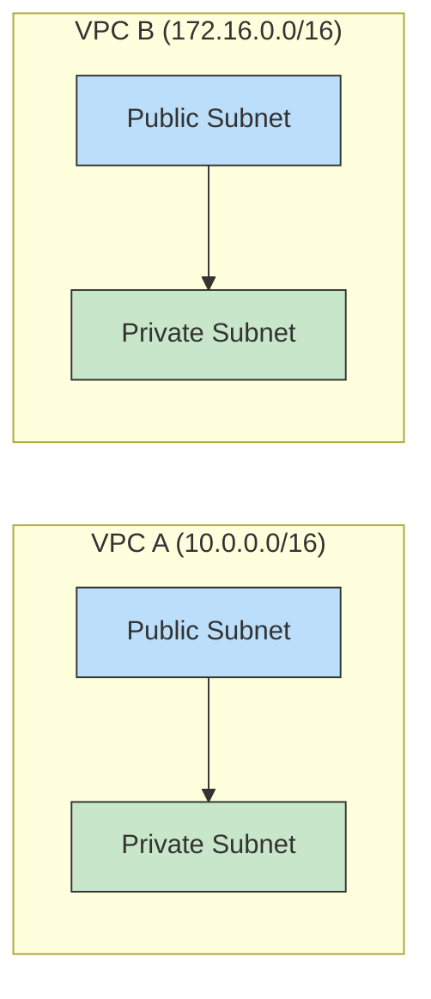
- 독립된 IP 주소 공간
- 계정별 완전한 관리
- 자체 라우팅 테이블
- 네트워크 접근 제어

#### 유연한 서브넷 구성
- Public/Private 서브넷 분리
- 가용영역별 서브넷 배치
- 용도별 네트워크 분할
- CIDR 블록 기반 주소 할당

#### 보안 제어
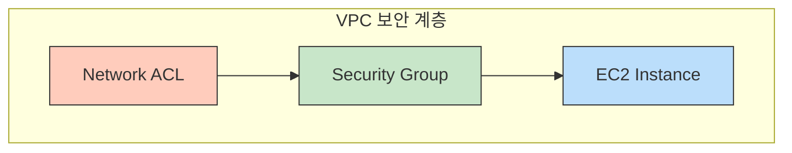
- 다중 보안 계층 구현
- 상태 기반/비상태 기반 방화벽
- 세분화된 접근 제어
- 트래픽 감사 및 로깅

### 기본 네트워크 패턴

#### 3-Tier 아키텍처
```plaintext
VPC (10.0.0.0/16)
├── Public Subnet (10.0.1.0/24)
│   ├── NAT Gateway
│   ├── Bastion Host
│   └── Load Balancer
├── Private App Subnet (10.0.2.0/24)
│   └── Application Servers
└── Private DB Subnet (10.0.3.0/24)
    └── Database Servers
```

#### 계층별 특징
- Public Subnet: 인터넷 접근 가능, 외부 서비스 호스팅
- Private App Subnet: 내부 애플리케이션, NAT 통한 외부 접근
- Private DB Subnet: 데이터베이스, 내부 통신만 허용

## 서브넷/게이트웨이/보안

### 서브넷 설계

#### CIDR 블록 설계
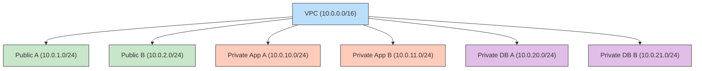

#### 설계 고려사항
- 적절한 IP 주소 범위 할당
- 향후 확장성 고려
- 가용영역별 대칭적 구성
- 계층별 주소 체계 표준화

#### 서브넷 유형별 구성

##### Public 서브넷
- 인터넷 게이트웨이 연결
- 공인 IP 할당 가능
- 외부 서비스 호스팅
- 로드밸런서, NAT 게이트웨이 배치

##### Private 서브넷
- 직접적인 인터넷 연결 없음
- NAT를 통한 외부 접근
- 내부 서비스 호스팅
- 데이터베이스, 애플리케이션 서버 배치

### 게이트웨이 구성

#### 게이트웨이 유형
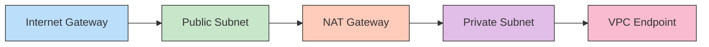

##### 인터넷 게이트웨이(IGW)
- 공인 인터넷 연결 제공
- 공인 IP와 내부 IP간 변환
- 라우팅 테이블과 연계
- IPv4/IPv6 지원

##### NAT 게이트웨이
- Private 서브넷의 외부 접근 지원
- 아웃바운드 전용 연결
- 고가용성 자동 제공
- 대역폭 자동 확장

##### VPC 엔드포인트
- 클라우드 내부 서비스 직접 연결
- 인터넷 우회 접근
- 보안성 강화
- 대역폭 비용 절감

### 보안 구성

#### 보안 계층
```plaintext
1. Network ACL (Subnet Level)
   - 상태 비저장(Stateless) 방화벽
   - 서브넷 단위 규칙 적용
   - 순서 기반 규칙 평가
   - 명시적 허용/차단

2. Security Group (Instance Level)
   - 상태 저장(Stateful) 방화벽
   - 인스턴스 단위 규칙 적용
   - 허용 규칙만 지정 가능
   - 참조 기반 규칙 지원
```

#### 보안 규칙 예시
```hcl
# Web Tier Security Group
ingress {
    from_port   = 80
    to_port     = 80
    protocol    = "tcp"
    cidr_blocks = ["0.0.0.0/0"]
}

# App Tier Security Group
ingress {
    from_port       = 8080
    to_port         = 8080
    protocol        = "tcp"
    security_groups = [aws_security_group.web_tier.id]
}

# DB Tier Security Group
ingress {
    from_port       = 3306
    to_port         = 3306
    protocol        = "tcp"
    security_groups = [aws_security_group.app_tier.id]
}
```

## 클라우드별 VPC 예시(AWS/GCP/Azure)

### AWS VPC

#### 기본 구성 요소
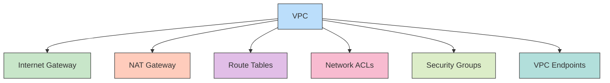

#### Terraform으로 구현하는 AWS VPC
```hcl
# VPC 생성
resource "aws_vpc" "main" {
  cidr_block           = "10.0.0.0/16"
  enable_dns_hostnames = true
  enable_dns_support   = true

  tags = {
    Name = "main-vpc"
  }
}

# 서브넷 생성
resource "aws_subnet" "public" {
  vpc_id                  = aws_vpc.main.id
  cidr_block              = "10.0.1.0/24"
  availability_zone       = "us-east-1a"
  map_public_ip_on_launch = true

  tags = {
    Name = "public-subnet"
  }
}

resource "aws_subnet" "private" {
  vpc_id            = aws_vpc.main.id
  cidr_block        = "10.0.2.0/24"
  availability_zone = "us-east-1a"

  tags = {
    Name = "private-subnet"
  }
}

# 라우팅 테이블 설정
resource "aws_route_table" "public" {
  vpc_id = aws_vpc.main.id

  route {
    cidr_block = "0.0.0.0/0"
    gateway_id = aws_internet_gateway.main.id
  }
}
```

### GCP VPC

#### 특징
- 글로벌 리소스로 관리
- 서브넷은 리전별 설정
- Auto Mode/Custom Mode VPC
- 고유한 방화벽 규칙 체계

#### 구현 예시
```yaml
# GCP VPC 구성
resources:
- name: vpc-network
  type: compute.v1.network
  properties:
    autoCreateSubnetworks: false
    routingConfig:
      routingMode: REGIONAL

- name: subnet-1
  type: compute.v1.subnetwork
  properties:
    network: $(ref.vpc-network.selfLink)
    region: us-central1
    ipCidrRange: 10.0.0.0/24
    privateIpGoogleAccess: true
```

### Azure VNet

#### 구성 요소
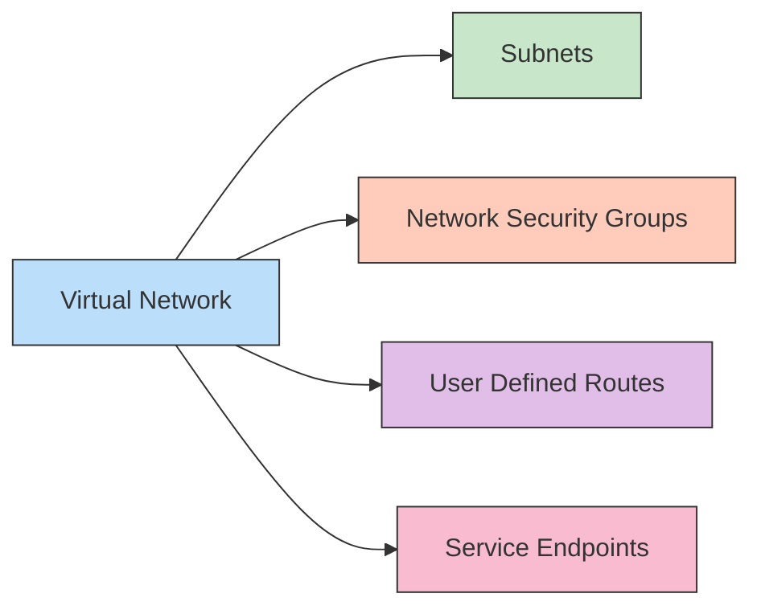

#### ARM 템플릿 예시
```json
{
    "type": "Microsoft.Network/virtualNetworks",
    "apiVersion": "2021-02-01",
    "name": "myVNet",
    "location": "eastus",
    "properties": {
        "addressSpace": {
            "addressPrefixes": ["10.0.0.0/16"]
        },
        "subnets": [
            {
                "name": "frontend",
                "properties": {
                    "addressPrefix": "10.0.1.0/24"
                }
            },
            {
                "name": "backend",
                "properties": {
                    "addressPrefix": "10.0.2.0/24",
                    "serviceEndpoints": [
                        {
                            "service": "Microsoft.Sql"
                        }
                    ]
                }
            }
        ]
    }
}
```

### 클라우드 간 주요 차이점

#### 네트워크 범위
- AWS: 리전 기반 VPC
- GCP: 글로벌 VPC, 리전별 서브넷
- Azure: 리전 기반 VNet

#### 기본 기능
| 기능 | AWS | GCP | Azure |
|-----|------|------------|------------|
| 서브넷 범위 | AZ | 리전 | 리전 | 
| 방화벽 | SG/NACL | Firewall Rules | NSG |
| 내부 DNS | Route 53 | Cloud DNS | Azure DNS |
| 서비스 연결 | VPC Endpoint | VPC SC | Service Endpoint |

## 하이브리드 클라우드(VPN/Direct Connect)

### VPN(IPSec) 연결

#### 구성 요소와 흐름
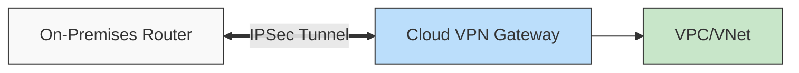

#### 주요 특징
- 암호화된 인터넷 통신
- 상대적으로 저렴한 구축 비용
- 가변적인 대역폭과 지연시간
- Active/Standby 이중화 구성

#### 구현 에시(AWS)
```hcl
# Customer Gateway
resource "aws_customer_gateway" "main" {
  bgp_asn    = 65000
  ip_address = var.customer_ip
  type       = "ipsec.1"
}

# VPN Gateway
resource "aws_vpn_gateway" "main" {
  vpc_id = aws_vpc.main.id
}

# VPN Connection
resource "aws_vpn_connection" "main" {
  vpn_gateway_id      = aws_vpn_gateway.main.id
  customer_gateway_id = aws_customer_gateway.main.id
  type               = "ipsec.1"
  static_routes_only = true
}
```

### Direct Connect/ExpressRoute

#### 구성 아키텍처
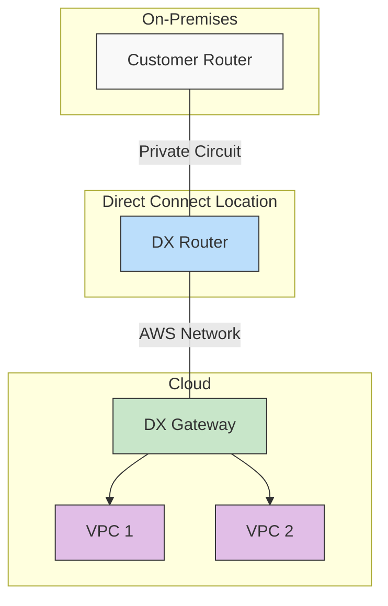

#### 특징
- 전용 물리 회선 연결
- 낮은 지연시간
- 예측 가능한 대역폭
- 높은 보안성과 안정성
- SLA 보장

### Transit Gateway/Hub-Spoke

#### 구성 개념
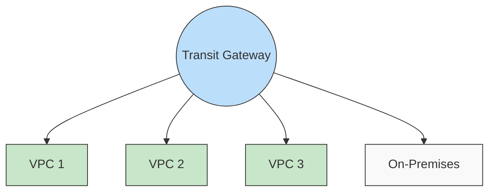

#### AWS Transit Gateway 구현
```hcl
# Transit Gateway
resource "aws_ec2_transit_gateway" "main" {
  description = "Main Transit Gateway"
  
  default_route_table_association = "enable"
  default_route_table_propagation = "enable"
  
  tags = {
    Name = "main-tgw"
  }
}

# VPC Attachment
resource "aws_ec2_transit_gateway_vpc_attachment" "vpc1" {
  subnet_ids         = [aws_subnet.private1.id]
  transit_gateway_id = aws_ec2_transit_gateway.main.id
  vpc_id             = aws_vpc.main.id
  
  tags = {
    Name = "vpc1-attachment"
  }
}
```

### 라우팅 및 보안 고려사항

#### 라우팅 전략
- 중첩되지 않는 IP 대역 설계
- BGP 라우팅 프로토콜 활용
- 라우팅 테이블 세분화
- 페일오버 시나리오 고려

#### 보안 구성
```plaintext
1. 네트워크 보안
   - IPSec 터널 암호화
   - BGP MD5 인증
   - VPN 모니터링
   - 트래픽 감사

2. 접근 제어
   - 전용선 물리 보안
   - VLAN 분리
   - MAC 주소 필터링
   - 포트 보안
```

## 컨테이너/쿠버네티스와 VPC

### 컨테이너 네트워크 인터페이스 (CNI)

#### CNI 아키텍처
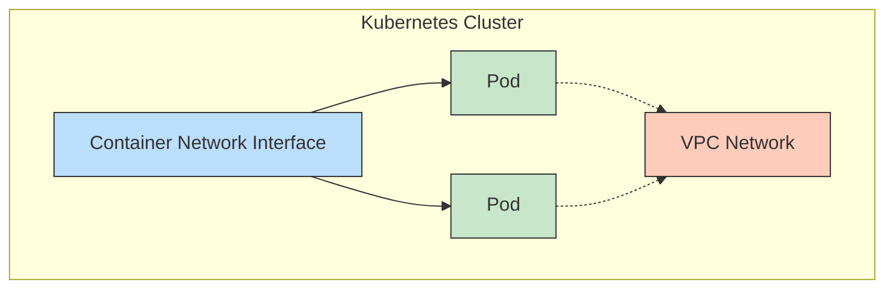

#### 주요 CNI 플러그인
- Flannel: 간단한 L3 네트워크
- Calico: 네트워크 정책과 보안
- Weave: 암호화와 자동 설정
- AWS VPC CNI: 네이티브 VPC 통합

#### VPC CNI 구현 예시
```yaml
apiVersion: v1
kind: ConfigMap
metadata:
  name: aws-vpc-cni
  namespace: kube-system
data:
  enable-network-policy: "true"
  enable-pod-eni: "true"
  warm-ip-target: "5"
  minimum-ip-target: "10"
```

### 서비스 메시 아키텍처

#### Istio 구성요소
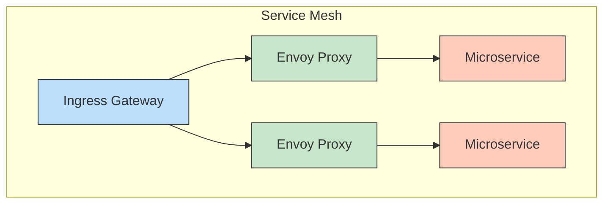

#### 주요 기능
- 트래픽 관리: 로드밸런싱, 라우팅
- 보안: mTLS, 접근 제어
- 관찰가능성: 메트릭, 추적, 로깅
- 정책 관리: 할당량, 속도 제한

#### Istio VirtualService 예시
```yaml
apiVersion: networking.istio.io/v1alpha3
kind: VirtualService
metadata:
  name: reviews-route
spec:
  hosts:
  - reviews.prod.svc.cluster.local
  http:
  - match:
    - headers:
        end-user:
          exact: jason
    route:
    - destination:
        host: reviews.prod.svc.cluster.local
        subset: v2
  - route:
    - destination:
        host: reviews.prod.svc.cluster.local
        subset: v1
```

### Serverless 네트워킹

#### VPC 통합
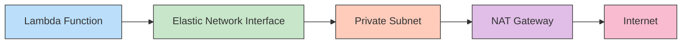

#### Lambda VPC 구성
```hcl
resource "aws_lambda_function" "example" {
  filename         = "lambda.zip"
  function_name    = "example"
  role            = aws_iam_role.lambda_role.arn
  handler         = "index.handler"
  runtime         = "nodejs14.x"

  vpc_config {
    subnet_ids         = [aws_subnet.private.id]
    security_group_ids = [aws_security_group.lambda.id]
  }
}
```

#### 고려사항
- Cold Start 성능 영향
- VPC 엔드포인트 활용
- ENI 리소스 관리
- 보안 그룹 설정

## 문서 요약 & 참고 자료

### Key Takeaways

#### 클라우드 네트워크 기본 구조
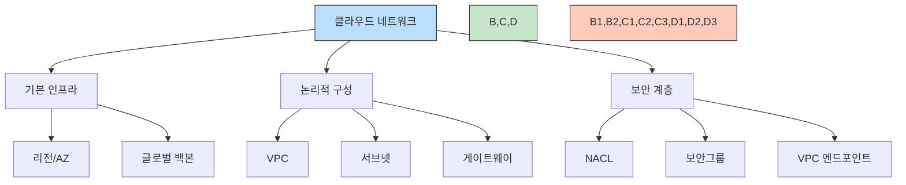

### 핵심 개념 정리

#### 네트워크 가상화
- 소프트웨어 정의 네트워킹(SDN)
- 동적 리소스 프로비저닝
- 자동화된 관리

#### 보안 설계
- 다중 계층 보안
- 마이크로세그멘테이션
- 암호화 및 접근 제어

#### 하이브리드 연결
- VPN/전용선 연결
- 멀티 클라우드 통합
- 글로벌 네트워크 구성

### 추가 학습 주제

#### 고급 네트워킹
- IPv6 전환 및 듀얼 스택
- 멀티캐스트 지원
- 전문 네트워크 서비스
- 커스텀 라우팅 정책

#### 성능 최적화
- 네트워크 지연 최소화
- 처리량 최적화
- 비용 효율적 설계
- 자동 스케일링

#### 보안 강화
- DDoS 방어
- WAF 구현
- 침입 탐지/방지
- 로깅 및 모니터링

### 참고 자료 

#### 공식 문서
- AWS VPC Documentation
- GCP VPC Documentation
- Azure Virtual Network Documentation
- Kubernetes Networking

#### 추천 도서
- "Amazon Web Services in Action"
- "Google Cloud Platform in Action"
- "Azure for Architects"
- "Kubernetes in Action"
- "Cloud Native Infrastructure"

### 유용한 도구
- 네트워크 다이어그램: Draw.io, Lucidchart
- 인프라 코드: Terraform, CloudFormation
- 모니터링: CloudWatch, Stackdriver
- 분석: VPC Flow Logs, Network Watcher