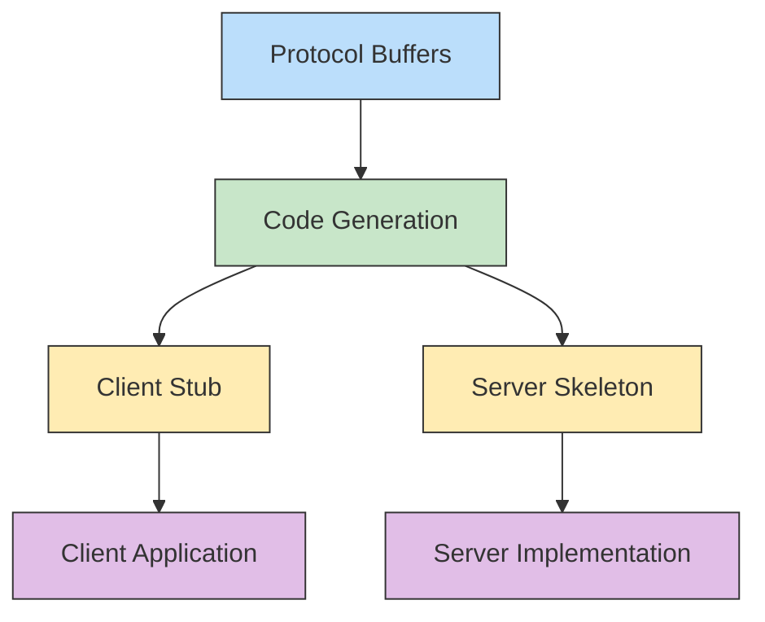
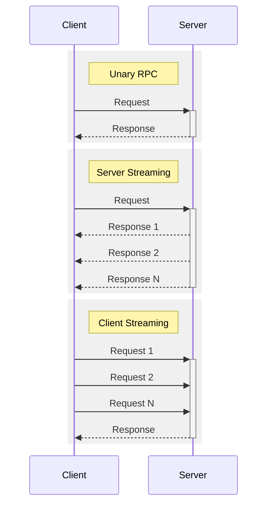
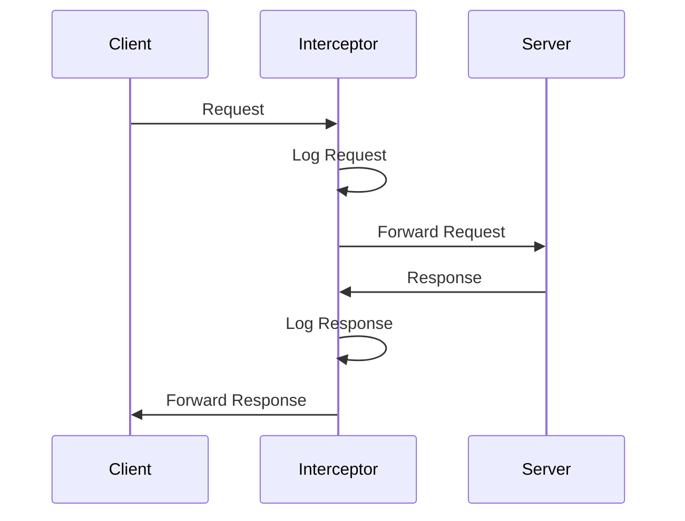
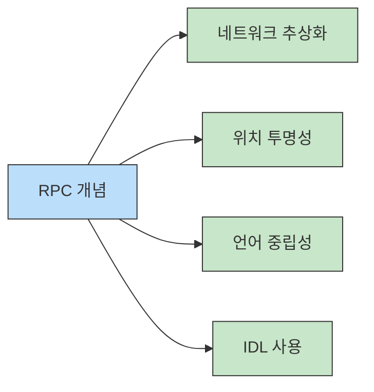

# RPC와 gRPC 이해하기 (RPC & gRPC in Details)

## 들어가기 (Introduction)

### RPC와 gRPC의 중요성
현대 분산 시스템에서 RPC(Remote Procedure Call)는 서비스 간 통신의 핵심 패턴으로 자리잡았습니다.
특히 gRPC는 Google이 개발한 고성능 RPC 프레임워크로, 마이크로서비스 아키텍처에서 널리 사용되고 있습니다.

### 현재 동향
- 마이크로서비스 아키텍처의 보편화
- 분산 시스템에서의 서비스 간 통신 증가
- 실시간 스트리밍 요구사항 증가
- 다양한 언어/플랫폼 간 상호운영성 필요

### 학습 목표
- RPC의 기본 개념과 동작 원리 이해
- gRPC의 특징과 장점 파악
- Protocol Buffers를 통한 인터페이스 정의 방법 습득
- 실제 gRPC 구현 및 운영 방법 학습

### 주요 활용 사례
- 마이크로서비스: 서비스 간 효율적인 통신
- 실시간 서비스: 양방향 스트리밍 활용
- 다국어 환경: 서로 다른 언어로 작성된 서비스 연동
- 모바일/웹: 클라이언트-서버 통신 최적화

## RPC(Remote Procedure Call) 기본 개념

### RPC란 무엇인가?
RPC는 분산 컴퓨팅 환경에서 원격 시스템의 프로시저(함수)를 로컬 시스템에서 호출하는 것처럼 사용할 수 있게 해주는 프로토콜입니다.
개발자는 네트워크 통신의 복잡성을 추상화하고, 마치 로컬 함수를 호출하는 것처럼 원격 서비스를 호출할 수 있습니다.

### 주요 특징
- 위치 투명성: 원격 호출을 로컬 호출처럼 처리
- 언어 중립성: 다양한 프로그래밍 언어 지원
- 네트워크 추상화: 통신 세부사항 은닉
- IDL(Interface Definition Language) 사용: 인터페이스 명확한 정의

### RPC 탄생 배경
- 분산 시스템의 복잡성 증가
- 네트워크 프로그래밍의 어려움
- 서비스 간 표준화된 통신 방식 필요
- 개발 생산성 향상 요구


## gRPC 개념

### gRPC의 등장 배경
gRPC는 Google에서 개발한 현대적인 오픈소스 RPC 프레임워크입니다. 내부 마이크로서비스들의 효율적인 통신을 위해 개발되었으며, 2015년 오픈소스로 공개되었습니다.

#### 핵심 기술 스택
- HTTP/2: 다중화, 헤더 압축, 서버 푸시 지원
- Protocol Buffers: 효율적인 바이너리 직렬화
- 다중 언어 지원: 주요 프로그래밍 언어에 대한 도구 제공
- 양방향 스트리밍: 실시간 데이터 처리 지원

### gRPC의 주요 특징

#### 성능과 효율성
- 바이너리 프로토콜 사용으로 높은 처리량
- HTTP/2 기반의 다중화로 연결 효율성 향상
- 헤더 압축을 통한 네트워크 사용량 감소
- 프로토콜 버퍼를 통한 효율적인 직렬화

#### 개발 편의성
- 강력한 IDE 지원
- 자동 코드 생성
- 타입 안정성 보장
- 명확한 API 계약



### gRPC vs REST vs GraphQL

#### 비교 관점
| 특징 | gRPC | REST | GraphQL |
|-----|------|------------|------------|
| 프로토콜 | HTTP/2 | HTTP | HTTP | 
| 페이로드 | Protocol Buffers | JSON | JSON |
| 계약 | Strict(.proto) | Loose(OpenAPI) | Strong(Schema) |
| 코드 생성 | 자동 | 선택적 | 자동 |
| 스트리밍 | 양방향 | 제한적 | WebSocket 필요 |
| 브라우저 지원 | 제한적 | 네이티브 | 네이티브 |

#### 최적 사용 사례
- gRPC: 마이크로서비스 간 통신, 저지연 실시간 통신
- REST: 범용 API, 브라우저 직접 통신
- GraphQL: 유연한 데이터 쿼리, 모바일 애플리케이션

## gRPC 동작 방식

### Protocol Buffers 정의
Protocol Buffers는 gRPC의 인터페이스 정의 언어(IDL)입니다. `.proto` 파일을 통해 서비스와 메시지 구조를 정의합니다.

#### 기본 구조 예시
```protobuf
syntax = "proto3";

package example;

service UserService {
  rpc GetUser (UserRequest) returns (UserResponse) {}
  rpc ListUsers (ListUserRequest) returns (stream UserResponse) {}
  rpc UpdateUser (stream UserUpdateRequest) returns (UserResponse) {}
  rpc ChatStream (stream ChatMessage) returns (stream ChatMessage) {}
}

message UserRequest {
  string user_id = 1;
}

message UserResponse {
  string user_id = 1;
  string name = 2;
  string email = 3;
  repeated string roles = 4;
}
```

#### RPC 호출 유형


## 실무 예시

### Proto 파일 예시와 구현
gRPC 서비스 구현의 첫 단계는 `.proto` 파일을 통해 서비스 인터페이스를 정의하는 것입니다.

#### 채팅 서비스 Proto 정의
```protobuf
syntax = "proto3";

package chatservice;

service ChatService {
  // 단순 메시지 전송
  rpc SendMessage (MessageRequest) returns (MessageResponse) {}
  
  // 채팅방 스트리밍
  rpc JoinChat (stream ChatMessage) returns (stream ChatMessage) {}
  
  // 사용자 상태 모니터링
  rpc WatchStatus (UserStatusRequest) returns (stream UserStatusResponse) {}
}

message ChatMessage {
  string user_id = 1;
  string message = 2;
  int64 timestamp = 3;
}

message MessageRequest {
  string room_id = 1;
  ChatMessage message = 2;
}

message MessageResponse {
  bool success = 1;
  string message_id = 2;
}

message UserStatusRequest {
  string user_id = 1;
}

message UserStatusResponse {
  string user_id = 1;
  enum Status {
    UNKNOWN = 0;
    ONLINE = 1;
    OFFLINE = 2;
    AWAY = 3;
  }
  Status status = 2;
  int64 last_seen = 3;
}
```

#### 서버 구현 (Go)
```go
package main

import (
    "log"
    "net"
    "google.golang.org/grpc"
    pb "example.com/chatservice"
)

type chatServer struct {
    pb.UnimplementedChatServiceServer
}

// 단순 메시지 전송 구현
func (s *chatServer) SendMessage(ctx context.Context, req *pb.MessageRequest) (*pb.MessageResponse, error) {
    log.Printf("Received message from user %s in room %s", 
        req.Message.UserId, req.RoomId)
    
    return &pb.MessageResponse{
        Success: true,
        MessageId: generateMessageId(),
    }, nil
}

// 양방향 스트리밍 채팅 구현
func (s *chatServer) JoinChat(stream pb.ChatService_JoinChatServer) error {
    for {
        in, err := stream.Recv()
        if err == io.EOF {
            return nil
        }
        if err != nil {
            return err
        }

        // 메시지 브로드캐스팅 로직
        if err := stream.Send(in); err != nil {
            return err
        }
    }
}

func main() {
    lis, err := net.Listen("tcp", ":50051")
    if err != nil {
        log.Fatalf("failed to listen: %v", err)
    }
    
    s := grpc.NewServer()
    pb.RegisterChatServiceServer(s, &chatServer{})
    
    log.Println("Starting gRPC server on port 50051...")
    if err := s.Serve(lis); err != nil {
        log.Fatalf("failed to serve: %v", err)
    }
}
```

#### 클라이언트 구현 (Python)
```python
import grpc
import chat_pb2
import chat_pb2_grpc
from datetime import datetime

def run():
    channel = grpc.insecure_channel('localhost:50051')
    stub = chat_pb2_grpc.ChatServiceStub(channel)

    # 단순 메시지 전송
    message = chat_pb2.ChatMessage(
        user_id="user123",
        message="Hello, gRPC!",
        timestamp=int(datetime.now().timestamp())
    )
    
    request = chat_pb2.MessageRequest(
        room_id="room456",
        message=message
    )
    
    response = stub.SendMessage(request)
    print(f"Message sent: {response.message_id}")

    # 스트리밍 채팅 참여
    def generate_messages():
        messages = [
            "First message",
            "Second message",
            "Third message"
        ]
        for msg in messages:
            yield chat_pb2.ChatMessage(
                user_id="user123",
                message=msg,
                timestamp=int(datetime.now().timestamp())
            )

    chat_stream = stub.JoinChat(generate_messages())
    try:
        for response in chat_stream:
            print(f"Received: {response.message}")
    except grpc.RpcError as e:
        print(f"Stream ended: {e}")

if __name__ == '__main__':
    run()
```

#### 로드 밸런싱 설정
```yaml
# Kubernetes Service 설정
apiVersion: v1
kind: Service
metadata:
  name: grpc-chat-service
spec:
  type: ClusterIP
  ports:
  - port: 50051
    targetPort: 50051
    protocol: TCP
    name: grpc
  selector:
    app: chat-service

---
# Deployment 설정
apiVersion: apps/v1
kind: Deployment
metadata:
  name: chat-service
spec:
  replicas: 3
  selector:
    matchLabels:
      app: chat-service
  template:
    metadata:
      labels:
        app: chat-service
    spec:
      containers:
      - name: chat-service
        image: example/chat-service:latest
        ports:
        - containerPort: 50051
```

## 고급 주제

### 인증/보안

#### TLS/SSL 설정
gRPC에서는 TLS를 통한 통신 암호화가 필수적입니다. 서버와 클라이언트 모두 적절한 인증서 설정이 필요합니다.

```go
// 서버 TLS 설정
func main() {
    // 인증서 로드
    creds, err := credentials.NewServerTLSFromFile(
        "server-cert.pem",
        "server-key.pem",
    )
    if err != nil {
        log.Fatalf("Failed to load certs: %v", err)
    }

    // TLS 적용된 서버 생성
    s := grpc.NewServer(grpc.Creds(creds))
    pb.RegisterServiceServer(s, &server{})
    
    if err := s.Serve(lis); err != nil {
        log.Fatalf("Failed to serve: %v", err)
    }
}
```

#### JWT 인증 구현
```go
// 인터셉터를 통한 JWT 검증
func authInterceptor(ctx context.Context, req interface{}, 
    info *grpc.UnaryServerInfo, handler grpc.UnaryHandler) (interface{}, error) {
    
    md, ok := metadata.FromIncomingContext(ctx)
    if !ok {
        return nil, status.Error(codes.Unauthenticated, "no metadata")
    }

    token := md["authorization"]
    if !validateToken(token) {
        return nil, status.Error(codes.Unauthenticated, "invalid token")
    }

    return handler(ctx, req)
}
```

### Observability 구현

#### Interceptor를 통한 로깅


```go
// 로깅 인터셉터 구현
func loggingInterceptor(ctx context.Context, req interface{}, 
    info *grpc.UnaryServerInfo, handler grpc.UnaryHandler) (interface{}, error) {
    
    start := time.Now()
    
    // 메서드 정보 로깅
    log.Printf("Method: %s, Started at: %v", info.FullMethod, start)
    
    // 실제 핸들러 호출
    resp, err := handler(ctx, req)
    
    // 응답 시간 측정 및 로깅
    duration := time.Since(start)
    log.Printf("Method: %s, Duration: %v, Error: %v", 
        info.FullMethod, duration, err)
    
    return resp, err
}
```

#### 분산 트레이싱
```go
// OpenTelemetry 트레이싱 설정
func initTracer() *sdktrace.TracerProvider {
    exporter, err := jaeger.New(...)
    if err != nil {
        log.Fatal(err)
    }
    
    tp := sdktrace.NewTracerProvider(
        sdktrace.WithBatcher(exporter),
        sdktrace.WithSampler(sdktrace.AlwaysSample()),
    )
    
    otel.SetTracerProvider(tp)
    return tp
}
```

### gRPC Gateway 설정
REST API와의 연동을 위한 gRPC Gateway 설정 예시입니다.

```protobuf
syntax = "proto3";

import "google/api/annotations.proto";

service UserService {
    rpc GetUser (GetUserRequest) returns (User) {
        option (google.api.http) = {
            get: "/v1/users/{user_id}"
        };
    }
}
```
```go
// Gateway 서버 설정
func main() {
    ctx := context.Background()
    mux := runtime.NewServeMux()
    
    opts := []grpc.DialOption{grpc.WithInsecure()}
    err := pb.RegisterUserServiceHandlerFromEndpoint(
        ctx, mux, "localhost:50051", opts,
    )
    
    // REST 서버 시작
    http.ListenAndServe(":8080", mux)
}
```

## 요약 (Summary)

### RPC 핵심 개념
- 분산 환경에서의 원격 함수 호출 패턴
- 네트워크 통신의 복잡성 추상화
- Stub/Skeleton 구조를 통한 투명한 호출
- IDL을 통한 인터페이스 정의



### gRPC의 강점

#### 기술적 이점
- HTTP/2 기반의 고성능 통신
- Protocol Buffers를 통한 효율적인 직렬화
- 양방향 스트리밍 지원
- 강력한 타입 안정성

#### 생산성 향상
- 자동화된 코드 생성
- 명확한 API 계약
- 다양한 언어 지원
- 풍부한 미들웨어 생태계

### 실무 적용 시 고려사항

#### 설계 관점
- 서비스 인터페이스 설계 신중히(.proto)
- 적절한 스트리밍 패턴 선택
- 버전 관리 전략 수립
- 에러 처리 표준화

#### 운영 관점
- 보안 설정(TLS, 인증)
- 모니터링 체계 구축
- 로드밸런싱 전략
- 장애 대응 계획

## 참고 자료 (References)

### 공식 문서
- gRPC 공식 웹사이트
- Protocol Buffers 문서
- HTTP/2 스펙

### 추천 도서
- "gRPC: Up and Running" - Kasun Indrasiri
- "Microservices Patterns" - Chris Richardson
- "Building Microservices" - Sam Newman

### 커뮤니티 리소스
- gRPC Github 저장소
- gRPC 사용자 그룹
- Protocol Buffers 디자인 패턴

### 실습 자료
- gRPC 예제 프로젝트
- 언어별 구현 가이드
- 성능 테스트 사례