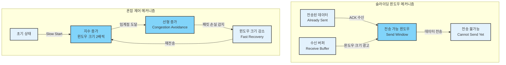

# TCP & UDP 이해하기

## 들어가기 (Introduction)

인터넷에서 데이터를 주고받을 때, 전송 계층에서 가장 중요한 두 프로토콜이 바로 TCP(Transmission Control Protocol)와 UDP(User Datagram Protocol)입니다.

### 전송 계층의 역할
- 종단 간(End-to-End) 통신 제공
- 상위 계층 애플리케이션에 데이터 전송 서비스 제공
- 포트 번호를 통한 프로세스 구분

### TCP와 UDP의 기본 특성
- TCP: 신뢰성 있는 데이터 전송
    - 연결 지향적 통신
    - 순서 보장
    - 오류 제어와 흐름 제어

- UDP: 단순하고 빠른 데이터 전송
    - 비연결형 통신
    - 최소한의 오버헤드
    - 실시간 응용에 적합

### 학습 목표
- TCP/UDP 헤더 구조와 각 필드의 역할 이해
- TCP 연결 설정/해제 과정 파악
- TCP의 흐름 제어와 혼잡 제어 메커니즘 이해
- 실제 패킷 분석을 통한 프로토콜 동작 확인

## TCP 기초

### TCP 헤더 구조

#### 기본 헤더 필드(20바이트)
- 출발지 포트 번호(16비트)
- 목적지 포트 번호(16비트)
- 시퀀스 번호(32비트)
    - 세그먼트의 순서 식별
    - 바이트 스트림 번호 부여

- 확인 응답 번호 (32비트)
    - 다음에 받기를 기대하는 시퀀스 번호

#### 제어 필드
- 헤더 길이(4비트)
- 예약 필드(6비트)
- 제어 플래그(6비트)
    - URG: 긴급 포인터 필드 유효
    - ACK: 확인 응답 번호 유효
    - PSH: 수신 애플리케이션에 즉시 전달
    - RST: 연결 리셋
    - SYN: 연결 설정
    - FIN: 연결 종료

### 연결 설정(3-way handshake)

#### 단계별 과정
- Step 1(SYN)
    - 클라이언트 -> 서버
    - SYN 플래그 설정
    - 초기 시퀀스 번호(ISN)전송

- Step 2(SYN + ACK)
    - 서버 -> 클라이언트
    - SYN, ACK 플래그 설정
    - 서버의 ISN 전송
    - 클라이언트 ISN + 1을 ACK로 전송

- Step 3(ACK)
    - 클라이언트 -> 서버
    - ACK 플래그 설정
    - 서버 ISN + 1을 ACK로 전송

#### 연결 설정 시 주요 특징
- 양방향 통신 채널 수립
- 초기 시퀀스 번호 동기화
- 버퍼 및 파라미터 협상


### 연결 해제(4-way termination)

#### 단계별 과정
- Step 1(FIN)
    - 클라이언트 -> 서버
    - FIN 플래그 설정
    - 연결 종료 요청

- Step 2(ACK)
    - 서버 -> 클라이언트
    - ACK 플래그 설정
    - FIN 수신 확인

- Step 3 (FIN)
    - 서버 -> 클라이언트
    - FIN 플래그 설정
    - 서버 측 연결 종료 준비 완료

- Step 4 (ACK)
    - 클라이언트 -> 서버
    - ACK 플래그 설정
    - 최종 연결 종료

#### TIME_WAIT 상태
- 지속 시간: 일반적으로 2MSL(Maximum Segment Lifetime)
- 목적:
    - 지연 패킷 처리
    - 신뢰성 있는 연결 종료 보장
    - 이전 연결의 패킷과 새 연결 패킷 구분


### 흐름 제어와 혼잡 제어

#### 흐름 제어(Flow Control)
- 슬라이딩 윈도우 메커니즘
    - 수신 버퍼 크기에 따른 전송량 조절
    - 윈도우 크기 동적 조정

- 수신 윈도우 광고
    - 수신 가능한 데이터 양 표시
    - TCP 헤더와 윈도우 필드 사용

#### 혼잡 제어(Congestion Control)
- Slow Start
    - 연결 초기에 윈도우 크기를 1부터 시작
    - 매 RTT마다 2배씩 증가

- Congestion Avoidance
    - 임계점 이후 선형적 증가
    - 패킷 손실 발생 시 윈도우 크기 감소

- Fast Retransmit/Recovery
    - 중복 ACK 3번 수신 시 즉시 재전송
    - 혼잡 윈도우 크기 절반으로 감소



## UDP 기초

### UDP 헤더 구조

#### 기본 헤더 필드(8바이트로 매우 단순)
- 출발지 포트 번호(16비트)
- 목적지 포트 번호(16비트)
- 길이 (16비트)
    - UDP 헤더와 데이터를 포함한 전체 길이

- 체크섬(16비트)
    - 선택적 필드(IPv4에서)
    - 데이터 무결성 검사용

### 비연결형 특성

#### 핵심 특징
- 연결 설정 과정 없음
- 상태 정보 유지하지 않음
- 데이터그램 단위의 독립적 전송
- 순서 보장 없음

#### 단순성의 장점
- 적은 프로토콜 오버헤드
- 지연 시간 최소화
- 구현이 단순
- 서버 리소스 부하 감소

### 주요 활용 사례

#### DNS(Domain Name Service)
- 간단한 쿼리/응답 구조
- 빠른 응답 시간 필요
- 재전송은 애플리케이션 레벨에서 처리

#### 실시간 스트리밍/VoIP
- 일부 패킷 손실 허용 가능
- 낮은 지연 시간이 중요
- 버퍼링으로 패킷 손실 대응

#### 온라인 게임
- 실시간 상태 업데이트
- 빠른 응답성 필요
- 최신 상태만 중요한 경우

#### SNMP(Simple Network Management Protocol)
- 네트워크 모니터링
- 주기적인 상태 정보 수립
- 간단한 요청/응답 구조


## TCP vs UDP

### 신뢰성, 속도, 오버헤드 관점

#### 연결 관리
- TCP:
    - 연결 설정 필요 (3-way handshake)
    - 연결 상태 유지
    - 연결 종료 절차 존재

- UDP:
    - 연결 설정 없음
    - 상태 유지하지 않음
    - 언제든 데이터 전송 가능

#### 데이터 전달 특성
- TCP:
    - 순서 보장
    - 데이터 무결성 보장
    - 흐름/혼잡 제어 제공
    - 높은 신뢰성

- UDP:
    - 순서 보장 없음
    - 데이터 손실 가능
    - 제어 메커니즘 없음
    - 빠른 전송 속도

#### 오버헤드 비교
- TCP:
    - 20바이트 기본 헤더
    - 제어 정보 교환 필요
    - 상태 유지에 따른 메모리 사용

- UDP:
    - 8바이트 헤더
    - 최소한의 제어 정보
    - 상태 유지 불필요

### 사용 사례 비교

#### TCP 적합한 애플리케이션
- 웹 브라우징(HTTP/HTTPS)
- 이메일(SMTP, POP3, IMAP)
- 파일 전송(FTP, SFTP)
- SSH 원격 접속
- 데이터베이스 통신

#### UDP 적합한 애플리케이션
- 실시간 스트리밍
- VoIP/화상 통화
- 온라인 게임
- DNS 쿼리
- DHCP
- IoT 센서 데이터 전송


## 실무 예시(패킷 분석 & 명령어)

### tcpdump/wireshark로 TCP/UDP 캡처

#### TCP 연결 분석
```bash
# TCP 3-way handshake 캡처
tcpdump -i eth0 'tcp[tcpflags] & (tcp-syn) != 0'

# 특정 포트의 TCP 트래픽 캡처
tcpdump -i eth0 'tcp port 80'

# TCP 플래그 확인
tcpdump -i eth0 'tcp[tcpflags] & (tcp-syn|tcp-fin|tcp-rst) != 0'
```

#### UDP 트래픽 분석
```bash
# UDP DNS 쿼리 캡처
tcpdump -i eth0 'udp port 53'

# 특정 포트의 UDP 트래픽
tcpdump -i eth0 'udp port 161'  # SNMP
```

### netstat/ss를 통한 연결 상태 확인

#### netstat 명령어
```bash
# TCP 연결 상태 확인
netstat -ant

# UDP 포트 확인
netstat -anu

# 연결 통계
netstat -s
```

#### ss 명령어 (더 현대적인 도구)
```bash
# TCP 연결 상태
ss -tan

# 상세 정보 포함
ss -tani

# TCP 상태별 통계
ss -s
```

### SYN flood, half-open 연결 등 장애 사례

#### SYN Flood 탐지
- 증상:
    - 다수의 SYN_RECV 상태
    - 서버 리소스 고갈
    - 새로운 연결 수립 불가

- 모니터링:
    ```bash
    # SYN_RECV 상태 개수 확인
    netstat -ant | grep SYN_RECV | wc -l

    # 연결 상태별 통계
    netstat -n | awk '/^tcp/ {++state[$NF]} END {for(key in state) print key,"\t",state[key]}'
    ```

#### 대응 방안
- SYN 쿠키 활성화
    ```bash
    # SYN 쿠키 설정
    sysctl -w net.ipv4.tcp_syncookies=1
    ```

- 백로그 큐 크기 조정
    ```bash
    # 백로그 큐 크기 증가
    sysctl -w net.ipv4.tcp_max_syn_backlog=4096
    ```

## 요약 (Summary)

### TCP와 UDP의 핵심 특징

#### TCP
- 신뢰성 있는 데이터 전송
- 연결 지향적 프로토콜
- 흐름 제어와 혼잡 제어
- 순서 보장과 오류 복구

#### UDP
- 단순하고 빠른 데이터 전송
- 비연결형 프로토콜
- 최소한의 오버헤드
- 실시간 애플리케이션에 적합

### 주요 메커니즘

#### TCP 연결 관리
- 3-way handshake로 연결 수립
- 4-way termination으로 연결 종료
- 슬라이딩 윈도우로 흐름 제어
- 혼잡 제어 알고리즘 적용

### 실무 응용

#### 상황별 프로토콜 선택
- 신뢰성 중요 -> TCP
- 속도 중요 -> UDP

#### 모니터링과 트러블슈팅
- tcpdump/wireshark로 패킷 분석
- netstat/ss로 연결 상태 확인
- 시스템 튜닝과 보안 설정

## 참고자료 (References)

### RFC 문서
- RFC 793: TCP 명세
- RFC 768: UDP 명세
- RFC 5681: TCP 혼잡 제어

### 추천 도서
- "TCP/IP Illustrated, Volume 1" by W. Richard Stevens
- "Computer Networks" by Andrew S. Tanenbaum
- "Network Warrior" by Gary A. Donahue

### 다음 학습 주제
- HTTP/HTTPS 프로토콜 (04_http_https.md)
- 애플리케이션 레벨 네트워킹
- 네트워크 보안과 성능 최적화