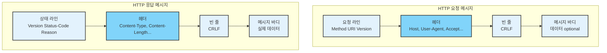
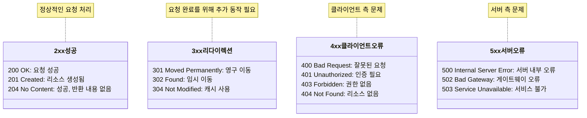

# HTTP/HTTPS 이해하기

## 들어가기 (Introduction)

웹의 기반이 되는 HTTP(Hypertext Transfer Protocol)는 웹 브라우저와 웹 서버 간의 데이터를 주고받기 위한 응용 계층 프로토콜입니다. HTTPS는 여기에 보안 계층을 추가한 프로토콜입니다.

### HTTP/HTTPS의 중요성
- 모든 웹 서비스의 기본 통신 프로토콜
- 클라이언트-서버 간 데이터 교환의 표준
- RESTful API의 기반 프로토콜

### 현재 동향
- HTTPS 사용이 표준화
- HTTP/2, HTTP/3 도입으로 성능 개선
- 보안 강화 추세(TLS 1.3등)

### 학습 목표
- HTTP 기본 구조와 동작 방식 이해
- HTTP 버전별 특징과 발전 과정 파악
- HTTPS의 보안 메커니즘 이해
- 실무에서의 서버 설정과 최적화 방법 습득

## HTTP 기초

### HTTP 프로토콜 개념

#### 기본 특성
- 클라이언트-서버 구조
- 상태가 없는(Stateless) 프로토콜
- 확장 가능한 프로토콜
- TCP/IP 기반(기본 포트 80번)

#### 핵심 특징
- 무상태(Stateless)
    - 각 요청은 독립적으로 처리
    - 이전 요청과 무관
    - 상태 유지를 위해 쿠키/세션 사용

- 비연결성(Connectionless)
    - 요청-응답 후 연결 종료
    - Keep-Alive로 연결 유지 가능

### HTTP 메시지 구조

#### 요청(Request) 메시지
```http
GET /index.html HTTP/1.1
Host: www.example.com
User-Agent: Mozilla/5.0
Accept: text/html

[메시지 바디는 선택적]
```
- 요청 라인: 메서드, URI, HTTP 버전
- 헤더: 부가 정보
- 빈 줄: 헤더와 바디 구분
- 바디: 전송할 데이터(선택적)

#### 응답(Response) 메시지
```http
HTTP/1.1 200 OK
Date: Mon, 13 Jan 2025 12:00:00 GMT
Content-Type: text/html
Content-Length: 1234

<!DOCTYPE html>
<html>...
```
- 상태 라인: HTTP 버전, 상태 코드, 상태 메시지
- 헤더: 응답 관련 정보
- 빈 줄: 구분자
- 바디: 실제 데이터



### 주요 HTTP 메서드

#### 기본 메서드
- GET:
    - 리소스 조회
    - 데이터를 URL에 포함하여 전송
    - 멱등성(idempotent) 보장

- POST:
    - 리소스 생성
    - 데이터를 메시지 바디에 포함
    - 서버 상태 변경 가능

- PUT:
    - 리소스 전체 수정
    - 해당 리소스가 없으면 생성
    - 멱등성 보장

- DELETE:
    - 리소스 삭제
    - 멱등성 보장

#### 추가 메서드
- PATCH:
    - 리소스 부분 수정
    - PUT과 달리 일부만 수정

- HEAD:
    - GET과 동일하나 헤더만 응답
    - 리소스 존재 여부 확인 시 사용

- OPTIONS:
    - 서버 지원 메서드 확인
    - CORS preflight 요청 시 사용

### 상태 코드

#### 1xx(정보)
- 100 Continue: 계속 진행
- 101 Switching Protocols: 프로토콜 전환

#### 2xx(성공)
- 200 OK: 요청 성공
- 201 Created: 리소스 생성 성공
- 204 No Content: 성공했으나 응답 본문 없음

#### 3xx(리다이렉션)
- 301 Moved Permanently: 영구 이동
- 302 Found: 임시 이동
- 304 Not Modified: 캐시된 리소스 사용

#### 4xx(클라이언트 오류)
- 400 Bad Request: 잘못된 요청
- 401 Unauthorized: 인증 필요
- 403 Forbidden: 권한 없음
- 404 Not Found: 리소스 없음

#### 5xx(서버 오류)
- 500 Internal Server Error: 서버 내부 오류
- 502 Bad Gateway: 게이트웨이 오류
- 503 Service Unavailable: 서비스 이용 불가



## HTTP/1.1 vs HTTP/2 vs HTTP/3

### HTTP/1.1의 특징과 한계

#### HTTP/1.1 주요 특징
- Keep-Alive 지원
    - 연결을 재사용하여 TCP 핸드셰이크 오버헤드 감소
    - 기본적으로 활성화

- 파이프라이닝(Pipelining)
    - 응답을 기다리지 않고 여러 요청을 연속해서 전송
    - Head-of-Line Blocking 문제 존재
    - 대부분의 브라우저에서 비활성화

#### HTTP/1.1의 한계점
- 요청 응답의 순차 처리
- 헤더 중복 전송
- 헤더 압축 미지원
- RTT(Round Trip Time)증가

### HTTP/2의 주요 개선사항

#### 멀티플렉싱(Multiplexing)
- 하나의 TCP 연결로 여러 요청/응답 처리
- 스트림 단위의 독립적 처리
- Head-of-Line Blocking 해결

#### 헤더 압축(HPACK)
- 헤더 필드 압축으로 중복 전송 방지
- 정적/동적 허프만 코딩 사용
- 대역폭 사용 효율화

#### 서버 푸시(Server Push)
- 클라이언트 요청 없이 리소스 선제적 전송
- 페이지 로드 시간 단축
- CSS, JS 등 관련 리소스 미리 전송

### HTTP/3 (QUIC)

#### QUIC 프로토콜 기반
- UDP 기반 전송 프로토콜
- 커넥션 설정 시간 단축
- 패킷 손실에 대한 개별 처리

#### 주요 특징
- 0-RTT 연결 설정
- 향상된 혼잡 제어
- 연결 마이그레이션 지원
- TLS 1.3 기본 통합

```mermaid
graph TD
    subgraph "HTTP/1.1"
        A1[TCP 연결] --> B1[순차적 요청/응답]
        B1 --> C1[Head of Line Blocking]
        C1 --> D1[텍스트 기반 헤더]
    end

    subgraph "HTTP/2"
        A2[단일 TCP 연결] --> B2[멀티플렉싱<br>병렬 스트림]
        B2 --> C2[HPACK<br>헤더 압축]
        C2 --> D2[서버 푸시]
    end

    subgraph "HTTP/3"
        A3[QUIC over UDP] --> B3[독립적인<br>스트림 처리]
        B3 --> C3[QPACK<br>헤더 압축]
        C3 --> D3[0-RTT<br>연결 설정]
    end

    style A1 fill:#e1bee7,stroke:#333
    style B1 fill:#e1bee7,stroke:#333
    style C1 fill:#e1bee7,stroke:#333
    style D1 fill:#e1bee7,stroke:#333

    style A2 fill:#bbdefb,stroke:#333
    style B2 fill:#bbdefb,stroke:#333
    style C2 fill:#bbdefb,stroke:#333
    style D2 fill:#bbdefb,stroke:#333

    style A3 fill:#c8e6c9,stroke:#333
    style B3 fill:#c8e6c9,stroke:#333
    style C3 fill:#c8e6c9,stroke:#333
    style D3 fill:#c8e6c9,stroke:#333
```



## HTTPS 기초 (TLS/SSL)

### HTTPS 동작 원리

#### HTTPS 개념
- HTTP + TLS/SSL (보안 계층)
- 기본 포트: 443
- 제공하는 보안 기능:
    - 데이터 암호화
    - 서버 인증
    - 메시지 무결성

#### 보안 메커니즘
- 대칭키 암호화
    - 실제 데이터 암호화에 사용
    - 빠른 암/복호화 속도

- 비대칭키 암호화
    - 대칭키 교환 과정에 사용
    - 서버 인증에 활용

### 인증서 개념(X.509)

#### 디지털 인증서 구성 요소
- 서버의 공개키
- 도메인 정보
- 인증서 발급자 정보
- 유효 기간
- 디지털 서명

#### 인증서 체인
- 루트 CA(Certificate Autority)
- 중간 CA
- 서버(엔드 엔티티) 인증서

#### 검증 과정
- 서명 검증
- 유효기간 확인
- 해지 여부 확인 (CRL/OCSP)

### TLS 핸드셰이크

#### 핸드셰이크 단계
- Client Hello
    - 지원하는 TLS 버전
    - 암호화 스위트(Cipher Suite)
    - 랜덤 데이터

- Server Hello
    - 지원하는 TLS 버전
    - 선택된 암호화 스위트
    - 서버 인증서

- 키 교환
    - 클라이언트 키 교환
    - ChangeCipherSpec
    - Finished


## 실무 예시 (서버 설정 & 패킷 분석)

### Nginx/Apache 서버에서 HTTPS 설정

#### Nginx HTTPS 설정 예시
```nginx
server {
    listen 443 ssl;
    server_name example.com;

    # SSL 인증서 설정
    ssl_certificate     /etc/letsencrypt/live/example.com/fullchain.pem;
    ssl_certificate_key /etc/letsencrypt/live/example.com/privkey.pem;

    # SSL 프로토콜 설정
    ssl_protocols TLSv1.2 TLSv1.3;
    ssl_ciphers ECDHE-ECDSA-AES128-GCM-SHA256:ECDHE-RSA-AES128-GCM-SHA256;
    ssl_prefer_server_ciphers on;

    # HSTS 설정
    add_header Strict-Transport-Security "max-age=31536000" always;
}
```

#### Apache HTTPS 설정 예시
```apache
<VirtualHost *:443>
    ServerName example.com
    
    SSLEngine on
    SSLCertificateFile      /etc/letsencrypt/live/example.com/cert.pem
    SSLCertificateKeyFile   /etc/letsencrypt/live/example.com/privkey.pem
    SSLCertificateChainFile /etc/letsencrypt/live/example.com/chain.pem

    # SSL 프로토콜 설정
    SSLProtocol all -SSLv3 -TLSv1 -TLSv1.1
    SSLCipherSuite ECDHE-ECDSA-AES128-GCM-SHA256:ECDHE-RSA-AES128-GCM-SHA256
</VirtualHost>
```

### 패킷 분석

#### HTTP 패킷 캡처
```bash
# HTTP 트래픽 캡처
tcpdump -i any 'port 80' -w http.pcap

# HTTPS 트래픽 캡처
tcpdump -i any 'port 443' -w https.pcap
```

#### SSL/TLS 연결 테스트
```bash
# SSL/TLS 연결 확인
openssl s_client -connect example.com:443 -servername example.com

# 인증서 정보 확인
openssl s_client -connect example.com:443 -servername example.com | openssl x509 -text
```

#### curl을 이용한 HTTP/HTTPS 테스트
```bash
# HTTP 헤더 확인
curl -I http://example.com

# HTTPS 상세 정보 확인
curl -vI https://example.com
```

## HTTP 보안/최적화

### HSTS, CSP 등 보안 헤더

#### HSTS(Http Strict Transport Security)
```http
Strict-Transport-Security: max-age=31536000; includeSubDomains
```
- HTTPS 강제 적용
- 중간자 공격 방지
- 브라우저가 HTTP를 HTTPS로 자동 변환

#### CSP(Content Security Policy)
```http
Content-Security-Policy: default-src 'self'; script-src 'self' 'unsafe-inline'
```
- XSS 공격 방지
- 리소스 로드 제한
- 인라인 스크립트 제어

### 캐싱, 압축, CDN 활용

#### 캐싱 설정
```http
Cache-Control: public, max-age=31536000
ETag: "33a64df551425fcc55e4d42a148795d9f25f89d4"
```
- 브라우저 캐싱
- 프록시 캐싱
- 조건부 요청

#### 압축 설정
```nginx
# Nginx 압축 설정
gzip on;
gzip_types text/plain text/css application/json application/javascript;
gzip_min_length 1000;
```

#### CDN 활용
- 정적 리소스 배포
- 지역별 엣지 서버
- 로드 밸런싱

### HTTP/2 성능 최적화

#### 서버 설정
```nginx
# Nginx HTTP/2 설정
listen 443 ssl http2;
http2_push_preload on;
```

#### 최적화 포인트
- 작은 파일 병합 지양
- 도메인 샤딩 제거
- 서버 푸시 활용
- 헤더 압축 활용

```mermaid
gantt
    title HTTP/1.1 vs HTTP/2 리소스 로딩
    dateFormat  X
    axisFormat %L

    section HTTP/1.1
    HTML        :h1, 0, 2
    CSS 파일 1   :h2, 2, 4
    CSS 파일 2   :h3, 4, 6
    JS 파일 1    :h4, 6, 8
    JS 파일 2    :h5, 8, 10
    이미지 1     :h6, 10, 12
    이미지 2     :h7, 12, 14

    section HTTP/2
    HTML        :h21, 0, 2
    CSS 파일 1   :h22, 1, 3
    CSS 파일 2   :h23, 1, 3
    JS 파일 1    :h24, 2, 4
    JS 파일 2    :h25, 2, 4
    이미지 1     :h26, 3, 5
    이미지 2     :h27, 3, 5
```



## 요약 (Summary)

### HTTP 기본 개념
- 요청/응답 기반의 애플리케이션 프로토콜
- 무상태(Stateless), 비연결성(Connectionless)
- 메서드와 상태 코드를 통한 통신
- 헤더를 통한 메타데이터 전송

### HTTP 버전별 진화
- HTTP/1.1: Keep-Alive, 파이프라이닝
- HTTP/2: 멀티플렉싱, 헤더 압축, 서버 푸시
- HTTP/3: QUIC 기반, 0-RTT, 향상된 성능

### HTTPS 보안
- TLS/SSL을 통한 암호화
- 인증서 기반의 서버 신원 확인
- 데이터 무결성 보장

### 실무 활용
- 웹 서버 HTTPS 설정
- 보안 헤더 적용
- 성능 최적화 기법 활용

## 참고 자료(References)

### RFC 문서
- RFC 2616: HTTP/1.1
- RFC 7540: HTTP/2
- RFC 9000: QUIC

### 추천 도서
- "HTTP: The Definitive Guide"
- "High Performance Browser Networking"
- "Web Performance in Action"

### 다음 학습 주제
- RESTful API 설계
- 웹 보안 심화
- 성능 최적화 전략