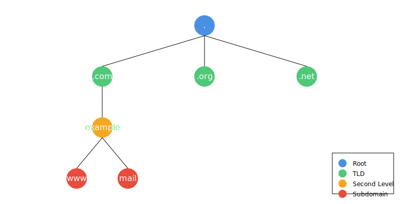
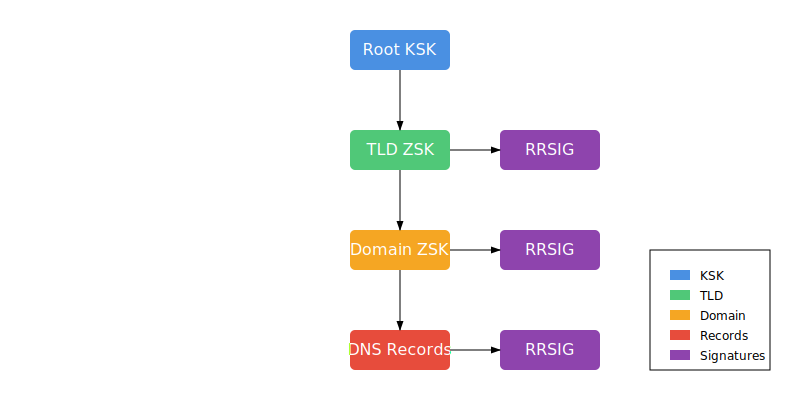

# DNS 이해하기 (DNS in Details)

## 들어가기 (Introduction)

인터넷의 핵심 인프라 중 하나인 DNS(Domain Name Service)는 사람이 이해하기 쉬운 도메인 이름을 컴퓨터가 이해할 수 있는 IP 주소로 변환하는 시스템입니다.
이는 마치 전화번호부와 같은 역할을 하며, 전 세계의 모든 도메인 정보를 분산된 데이터베이스 형태로 관리합니다.

### 역사적 배경

초기 인터넷에서는 HOSTS 파일에 모든 컴퓨터의 이름과 IP 주소를 직접 기록하여 관리했습니다. 하지만 인터넷의 급속한 성장으로 이러한 중앙집중식 관리 방식은 한계에 도달했고, 1983년 DNS가 제안되어 현재의 분산형 시스템으로 발전했습니다.

### DNS의 중요성

현대 인터넷 환경에서 DNS는 다음과 같은 핵심적인 역할을 수행합니다:

- 웹 브라우징: example.com과 같은 도메인 이름을 IP 주소로 변환
- 이메일: 메일 서버 위치 정보 제공
- 서비스 디스커버리: 다양한 서비스의 위치 정보 제공
- 로드 밸런싱: 트래픽 분산을 위한 지리적 라우팅 지원

### 학습 목표

이 문서를 통해 다음 내용을 이해할 수 있습니다:

- DNS의 기본 구조와 작동 원리
- 다양한 DNS 레코드 유형과 그 용도
- DNS 서버 구성과 관리 방법
- DNS 보안과 최신 보안 기술
- 클라우드 환경에서의 DNS 활용
- 실무에서 자주 사용되는 DNS 관련 도구와 명령어

## DNS 기본 개념

### 도메인 계층 구조

DNS는 계층적 구조를 통해 전 세계의 도메인을 체계적으로 관리합니다. 이 구조는 역트리(Inverted Tree) 형태를 가지며, 최상위에서 하위로 내려갈수록 더 구체적인 정보를 담고 있습니다.



계층 구조의 각 레벨은 다음과 같은 역할을 합니다:

#### 루트(Root) "."
- DNS 계층의 최상위 레벨
- 전 세계 13개의 루트 서버 그룹에 의해 관리됨

#### 최상위 도메인(TLD, Top Level Domain)
- 일반 최상위 도메인(gTLD): .com, .org, .net 등
- 국가 코드 최상위 도메인(ccTLD): .kr, .jp, .us 등
- 새로운 gTLD: .blog, .shop, .app 등

#### 2차 도메인(Second Level Domain)
- 조직이나 서비스를 식별하는 고유 이름
- 예: google.com에서 google' 부분

#### 서브 도메인(Subdomain)
- 조직 내 서비스나 부서를 구분
- 예: mail.example.com, www.example.com

### DNS 쿼리 흐름

DNS 쿼리는 재귀적(Recursive) 방식과 반복식(Iterative) 방식으로 처리됩니다. 사용자가 도메인 이름을 입력하면 다음과 같은 순서로 처리됩니다:

1. 클라이언트 -> 로컬 DNS 서버(Recursive Resolver)에 쿼리를 보냄
2. 로컬 DNS 서버 -> 루트 DNS 서버에 쿼리
3. 루트 서버는 해당 TLD의 DNS 서버 정보를 응답
4. 로컬 DNS 서버는 TLD DNS 서버에 쿼리
5. TLD 서버는 권한 있는 네임서버 정보를 응답
6. 로컬 DNS 서버는 권한 있는 네임서버에 쿼리 -> 최종 IP 주소를 받음

### DNS 캐싱과 TTL

DNS 캐싱은 조회 성능을 향상시키고 네트워크 트래픽을 줄이는 중요한 메커니즘입니다:

- TTL(Time To Live): 레코드의 유효 기간을 초 단위로 지정
- 브라우저 DNS 캐시: 웹 브라우저 레벨의 캐싱
- OS DNS: 운영체제 레벨의 캐싱
- Recursive DNS 서버 캐시: DNS 서버 레벨의 캐싱

#### TTL 값 설정 시 고려사항
- 낮은 TTL: 빠른 변경 반영, 높은 쿼리 부하
- 높은 TTL: 효율적인 캐싱, 변경 반영 지연
- 일반적으로 3600(1시간) ~ 86400(24시간) 사이의 값 사용

## DNS 레코드 유형

### 주요 DNS 레코드 유형

각 레코드 유형은 도메인에 대한 특정 정보를 제공하며, 용도에 따라 적절히 선택하여 사용합니다:

#### A 레코드(Address Record)
- 도메인 이름을 IPv4 주소에 매핑
- 예: `example.com IN A 93.184.216.34`

#### AAAA 레코드(IPv6 Address Record)
- 도메인 이름을 IPv6 주소에 매핑
- 예: `example.com. IN AAAA 2606:2800:220:1:248:1893:25c8:1946`

#### CNAME 레코드(Canonical Name)
- 도메인의 별칭을 지정
- 예: `www.example.com. IN CNAME example.com.`
- 주의: 동일한 이름의 다른 레코드 타입과 공존할 수 없음

#### MX 레코드(Mail Exchanger)
- 메일 서버 지정
- 우선순위(priority) 값을 포함
- 예: `example.com. IN MX 10 mail1.example.com.`
- 예: `example.com. IN MX 20 mail2.example.com.`

#### NS 레코드 (Name Server)
- 도메인의 권한 있는 네임서버 지정
- 예: `example.com. IN NS ns1.example.com.`

#### TXT 레코드(Text)
- 임의의 텍스트 정보 저장
- SPF, DKIM 등 이메일 인증에 주로 사용
- 예: `example.com. IN TXT "v=spf1 include:_spf.example.com ~all"`

#### PTR 레코드(Pointer)
- IP 주소를 도메인 이름으로 매핑(역방향 조회)
- 예: `34.216.184.93.in-addr.arpa. IN PTR example.com.`

#### SOA 레코드(Star Of Authority)
- 도메인의 권한 정보와 존 파일 관리 정보 포함
- 모든 존의 필수 레코드

### 실제 Zone 파일 예시
```zone
; example.com zone file
$TTL 86400
@       IN      SOA     ns1.example.com. admin.example.com. (
                        2024011401  ; Serial
                        3600        ; Refresh (1 hour)
                        1800        ; Retry (30 minutes)
                        604800      ; Expire (1 week)
                        86400 )     ; Minimum TTL (1 day)

; Name servers
@       IN      NS      ns1.example.com.
@       IN      NS      ns2.example.com.

; A records
@       IN      A       93.184.216.34
www     IN      A       93.184.216.34
ns1     IN      A       93.184.216.35
ns2     IN      A       93.184.216.36

; Mail servers
@       IN      MX      10 mail1.example.com.
@       IN      MX      20 mail2.example.com.
mail1   IN      A       93.184.216.37
mail2   IN      A       93.184.216.38

; CNAME records
ftp     IN      CNAME   www.example.com.
webmail IN      CNAME   mail1.example.com.

; TXT records for email authentication
@       IN      TXT     "v=spf1 ip4:93.184.216.0/24 include:_spf.example.com -all"
mail._domainkey IN TXT  "v=DKIM1; k=rsa; p=MIGfMA0GCSqGSIb3DQEBAQUAA4..."
```

- 이 파일에서 주목할 점들:

1. SOA 레코드 구성 요소
    - Serial: Zone 파일의 버전 관리 번호
    - Refresh: 보조 네임서버가 SOA를 확인하는 주기
    - Retry: 갱신 실패 시 재시도 간격
    - Expire: 보조 네임서버의 데이터 유효 기간
    - Minimum TTL: 네거티브 캐싱 TTL 값

2. 레코드 작성 규칙
    - `@`는 현재 도메인(example.com)을 의미
    - 완전한 도메인 이름(FQDN)은 마침표(.)로 끝남
    - TTL은 초 단위 지정

3. 주요 설정 패턴
    - 웹 서버: A 레코드와 CNAME
    - 메일 서버: MX 레코드와 관련 A 레코드
    - 이메일 인증: SPF, DKIM용 TXT 레코드

## DNS 서버와 구성

### DNS 서버 유형

DNS 서버는 역할에 따라 크게 두 가지로 구분됩니다:

#### Recursive Resolver(재귀적 리졸버)
- 클라이언트의 DNS 쿼리를 대신 해결
- DNS 캐시 유지 관리
- 대표적인 공용 DNS:
    - Google Public DNS(8.8.8.8, 8.8.4.4)
    - Cloudflare DNS(1.1.1.1, 1.0.0.1)
    - Quad9(9.9.9.9)

#### Autoritative DNS Server(권한 있는 네임서버)
- 특정 도메인의 DNS 레코드를 직접 관리
- Zone 파일 보유
- 최종적인 DNS 정보 제공

### 주요 DNS 서버 소프트웨어

#### DNS 서버 설정 예시
```conf
# 1. BIND 기본 설정 (named.conf)
options {
    directory "/var/named";
    allow-query { any; };
    recursion yes;
    dnssec-validation auto;
    listen-on-v6 { any; };
};

zone "example.com" IN {
    type primary;
    file "example.com.zone";
    allow-transfer { 192.168.1.2; };
};

# 2. PowerDNS 설정 (pdns.conf)
launch=gpgsql
gpgsql-host=localhost
gpgsql-user=pdns
gpgsql-dbname=pdns
gpgsql-password=secret
api=yes
api-key=secret_key
webserver=yes
webserver-port=8081

# 3. CoreDNS 설정 (Corefile)
example.com {
    file /etc/coredns/example.com.zone
    prometheus
    cache 3600
    forward . 8.8.8.8 8.8.4.4
    log
    errors
}

. {
    forward . 8.8.8.8 8.8.4.4
    cache 3600
    log
    errors
}
```

#### BIND(Berkeley Internet Name Domain)
- 가장 널리 사용되는 전통적인 DNS 서버
- 특징:
    - 풍부한 문서와 커뮤니티 지원
    - 안정적인 성능
    - 복잡한 설정이 가능

- 주요 설정 파일:
    - named.conf: 메인 설정 파일
    - zone 파일: 도메인별 DNS 레코드

#### PowerDNS
- 현대적이고 유연한 DNS 서버
- 특징:
    - 다양한 백엔드 지원(MySQL, PostgreSQL 등)
    - REST API 제공
    - 웹 인터페이스 지원

- 구성 요소:
    - pdns_server: 권한 있는 네임서버
    - pdns_recursor: 재귀적 리졸버

#### CoreDNS
- Go 언어로 작성된 현대적인 DNS 서버
- 특징:
    - 쿠버네티스 기본 DNS 서버
    - 플러그인 아키텍처
    - 가벼운 리소스 사용

- 설정:
    - Corefile을 통한 간단한 설정
    - 플러그인 기반 기능 확장

### DNS 서버 운영 시 고려사항

#### 보안
- TSIG를 이용한 존 전송 암호화
- ACL을 통한 쿼리 제한
- 최신 보안 패치 적용

#### 모니터링
- 쿼리 응답 시간
- 캐시 히트율
- 리소스 사용량(CPU, 메모리)
- 오류 로그 모니터링

#### 이중화
- 마스터-슬레이브 구성
- Anycast DNS 구성
- 지리적 분산 배치

#### 성능 최적화
- 적절한 캐시 크기 설정
- TTL 값 최적화
- 쿼리 로깅 수준 조정

## DNS 보안

### DNSSEC (DNS Security Extensions)

DNSSEC은 DNS 응답의 무결성과 출처를 보장하기 위한 보안 확장 기능입니다.



DNSSEC의 주요 구성요소:

#### 키 종류
- KSK (Key Signing Key): 상위 키 서명용
- ZSK (Zone Signing Key): 실제 레코드 서명용

#### 레코드 유형
- DNSKEY: 공개키 저장
- RRSIG: 레코드 서명
- DS: 상위 도메인에 등록되는 키 해시
- NSEC/NSEC3: 존재하지 않는 도메인 증명

### DNS 공격과 대응

#### 캐시 포이즈닝 (Cache Poisoning)
- 공격 방식:
    - DNS 서버의 캐시에 잘못된 정보 주입
    - 트랜잭션 ID 및 포트 예측

- 대응:
    - DNSSEC 적용
    - 소스 포트 무작위화
    - DNS 쿼리 ID 무작위화

#### DNS 수푸핑
- 공격 방식:
    - 중간자 공격으로 DNS 응답 위조
    - 로컬 DNS 서버 설정 변조

- 대응:
    - DNS over HTTPS(DoH) 사용
    - DNS over TLS(DoT) 사용
    - DNS 트래픽 모니터링

### DNS over HTTPS(DoH) / DNS over TLS(DoT)

#### DNS over HTTPS (DoH)
- HTTPS를 통한 DNS 쿼리 암호화
- 장점:
    - 웹 트래픽과 구분 불가
    - 방화벽 우회 가능

- 설정 예시:
    ```plaintext
    Firefox DoH 설정:
    about:config → network.trr.mode → 2
    network.trr.uri → https://mozilla.cloudflare-dns.com/dns-query
    ```

#### DNS over TLS (DoT)
- TLS를 통한 DNS 쿼리 암호화
- 표준 포트: 853
- 장점:
    - 전용 포트로 관리 용이
    - 더 낮은 오버헤드

### 보안 모니터링과 감사

#### 로깅 설정
- 쿼리 로그
- 오류 로그
- DNSSEC 검증 실패 로그

#### 모니터링 포인트
- 비정상적인 쿼리 패턴
- DNSSEC 검증 실패융
- 응답 시간 변화
- 캐시 히트율 변화

## 클라우드 DNS 활용

### AWS Route 53

#### 주요 특징
- 전 세계 엣지 로케이션을 통한 빠른 응답
- 여러 라우팅 정책 지원
- AWS 서비스와의 긴밀한 통합
- 상태 확인(Health Check) 기능

#### Route 53 설정 예시
```json
{
    "Changes": [
        {
            // 단순 라우팅
            "Simple": {
                "Name": "www.example.com",
                "Type": "A",
                "TTL": 300,
                "ResourceRecords": [
                    {"Value": "192.0.2.1"}
                ]
            }
        },
        {
            // 가중치 기반 라우팅
            "Weighted": {
                "Name": "api.example.com",
                "Type": "A",
                "SetIdentifier": "Primary",
                "Weight": 80,
                "ResourceRecords": [
                    {"Value": "192.0.2.2"}
                ]
            }
        },
        {
            // 지연 시간 기반 라우팅
            "Latency": {
                "Name": "app.example.com",
                "Type": "A",
                "Region": "ap-northeast-2",
                "SetIdentifier": "Seoul Region",
                "ResourceRecords": [
                    {"Value": "192.0.2.3"}
                ]
            }
        },
        {
            // 장애 조치 라우팅
            "Failover": {
                "Name": "failover.example.com",
                "Type": "A",
                "SetIdentifier": "Primary",
                "Failover": "PRIMARY",
                "HealthCheckId": "health-check-id",
                "ResourceRecords": [
                    {"Value": "192.0.2.4"}
                ]
            }
        },
        {
            // 지리적 위치 기반 라우팅
            "Geolocation": {
                "Name": "geo.example.com",
                "Type": "A",
                "SetIdentifier": "Korea",
                "GeoLocation": {
                    "CountryCode": "KR"
                },
                "ResourceRecords": [
                    {"Value": "192.0.2.5"}
                ]
            }
        }
    ]
}
```

#### 라우팅 정책
- 단순 라우팅: 기본적인 DNS 라우팅
- 가중치 기반: 트래픽 분산
- 지연 시간 기반: 최소 지연 시간 제공
- 장애 조치: 자동 백업 시스템
- 지리적 위치: 사용자 위치 기반 라우팅
- 다중 응답: 무작위 순서로 여러 값 반환

### Google Cloud DNS

#### 주요 기능
- 관리형 DNS 서비스
- anycast 네트워크 사용
- Cloud Console을 통한 관리
- 프로그래매틱 API 접근

#### 구성 예시
```bash
# 영역 생성
gcloud dns managed-zones create "example-zone" \
    --dns-name="example.com." \
    --description="Example DNS zone" \
    --dnssec-state="on"

# 레코드 세트 생성
gcloud dns record-sets create "www.example.com." \
    --type="A" \
    --ttl="300" \
    --rrdatas="192.0.2.1" \
    --zone="example-zone"
```

### Azure DNS

#### 핵심 기능
- Azure 리소스와 통합
- 프라이빗/퍼블릭 DNS 영역
- Azure CLI를 통한 관리
- 다중 인증 지원

#### 특별 기능
- Alias 레코드: Azure 리소스 자동 업데이트
- CAA 레코드 지원
- DNS 분석 및 메트릭

### 클라우드 DNS 서비스 비교

#### 공통 장점
- 높은 가용성
- 글로벌 분산
- 관리 용이성
- API 지원

#### 선택 시 고려사항
- 비용 구조
- 기존 클라우드 서비스와의 통합
- 지원하는 레코드 타입
- 관리 도구의 사용 편의성
- SLA 수준

#### 모범 사례
- 적절한 TTL 설정
- 헬스 체크 구성
- 모니터링 설정
- 백업 DNS 구성 고려

## DNS 실무 예시 & 명령어

### dig 명령어 활용
```bash
# 1. 기본 A 레코드 조회
dig example.com A

; <<>> DiG 9.16.1-Ubuntu <<>> example.com A
;; QUESTION SECTION:
;example.com.			IN	A

;; ANSWER SECTION:
example.com.		3600	IN	A	93.184.216.34

# 2. 특정 DNS 서버를 지정하여 조회
dig @8.8.8.8 example.com A

# 3. 모든 레코드 타입 조회 (+short 옵션으로 간단히)
dig example.com ANY +short
93.184.216.34
ns1.example.com.
ns2.example.com.
"v=spf1 include:_spf.example.com ~all"

# 4. 역방향 DNS 조회
dig -x 93.184.216.34

# 5. DNSSEC 검증 (+dnssec 옵션)
dig example.com A +dnssec

# 6. DNS 추적 (+trace 옵션)
dig example.com A +trace

# 7. MX 레코드 조회
dig example.com MX
```

### nslookup 사용법

Windows와 Linux 모두에서 사용 가능한 기본 DNS 조회 도구입니다:

#### 대화형 모드
```bash
nslookup
> set type=MX
> example.com
> set type=NS
> example.com
> exit
```

#### 명령행 모드
```bash
nslookup -type=MX example.com
nslookup -type=ANY example.com 8.8.8.8
```

### DNS 트러블슈팅

#### Windows DNS 캐시 관리
```powershell
# DNS 캐시 확인
ipconfig /displaydns

# DNS 캐시 초기화
ipconfig /flushdns

# DNS 캐시 새로고침
ipconfig /registerdns
```

#### Linux DNS 트러블슈팅
```bash
# systemd-resolve 상태 확인
systemd-resolve --status

# DNS 캐시 초기화 (systemd-resolved)
systemd-resolve --flush-caches

# resolv.conf 확인
cat /etc/resolv.conf
```

### DNS 모니터링 도구

#### dnstop: DNS 트래픽 모니터링
```bash
dnstop eth0
```

#### dnsperf: DNS 성능 테스트
```bash
dnsperf -s 8.8.8.8 -d queryfile -c 10 -Q 1000
```

### 고급 DNS 설정 예시

#### 라운드 로빈 DNS 설정
```bash
example.com.    IN    A    192.0.2.1
example.com.    IN    A    192.0.2.2
example.com.    IN    A    192.0.2.3
```

#### Geo DNS 설정 (AWS Route 53 예시)
```json
{
    "Name": "www.example.com",
    "Type": "A",
    "SetIdentifier": "Asia",
    "GeoLocation": {
        "ContinentCode": "AS"
    },
    "ResourceRecords": [
        {"Value": "192.0.2.1"}
    ]
}
```

### 일반적인 DNS 문제와 해결 방법

#### 일반적인 문제
- DNS 전파 지연
- 캐시 불일치
- DNSSEC 검증 실패
- 잘못된 레코드 설정

#### 해결 단계
- DNS 캐시 초기화
- dig/nslookup으로 레코드 확인
- TTL 값 확인
- 권한 있는 네임서버 직접 조회

## 요약 (Summary)

### DNS 핵심 개념

#### 기본 구조
- DNS는 도메인 이름을 IP 주소로 변환하는 전 세계적인 분산 데이터베이스 시스템
- 계층적 구조: Root -> TLD(.com, .org 등) -> Second-level -> subdomain
- 분산형 구조로 단일 실패 지점 방지

#### 작동 원리
- 재귀적/반복적 쿼리 처리
- 캐시를 통한 성능 최적화
- TTL을 통한 레코드 유효기간 관리

### 주요 구성 요소

#### DNS 레코드
- A/AAAA: IPv4/IPv6 주소 매핑
- CNAME: 별칭
- MX: 메일 서버
- NS: 네임서버
- TXT: 텍스트 정보

#### DNS 서버 유형
- Recursive Resolver: 클라이언트 요청 처리
- Authoritative Server: 도메인 정보 제공
- Root/TLD 서버: 최상위 도메인 정보 관리

### 보안과 최신 동향

#### 보안 기술
- DNSSEC: DNS 응답 무결성 보장
- DoH/DoT: DNS 쿼리 암호화
- 캐시 포이즈닝 방지 기술

#### 클라우드 DNS
- AWS Route 53
- Google Cloud DNS
- Azure DNS
- 고가용성과 글로벌 분산 처리

### 실무 적용

#### 관리 도구
- dig: DNS 조회 및 트러블슈팅
- nslookup: 기본 DNS 조회
- DNS 캐시 관리 도구

#### 고급 기능
- 라운드 로빈 DNS
- Geo DNS
- 상태 확인 및 장애 조치

## 참고 자료 (References)

### 표준 문서
- RFC 1034, 1035: DNS 기본 사양
- RFC 4033 - 4035: DNSSEC 사양
- RFC 8484: DNS over HTTPS(DoH)

### 추천 도서
- "DNS and BIND" (Cricket Liu)
- "Pro DNS and BIND 10" (Apress)
- "DNSSEC Mastery" (Michael W Lucas)